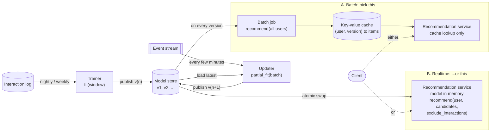
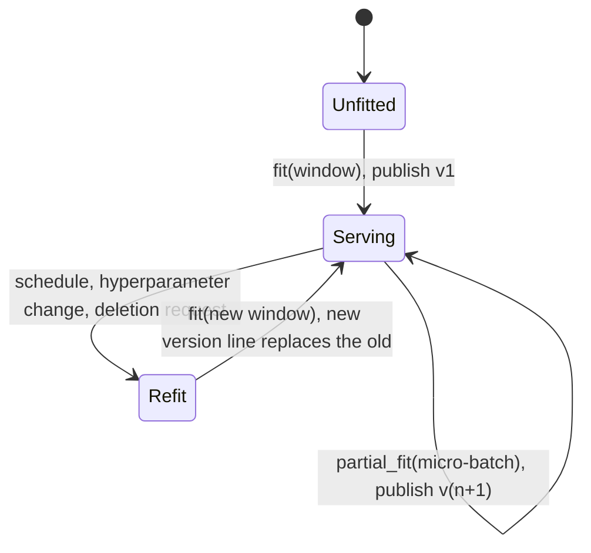
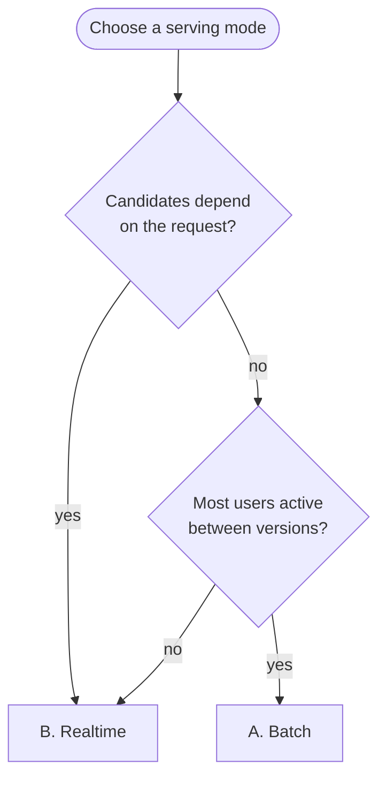
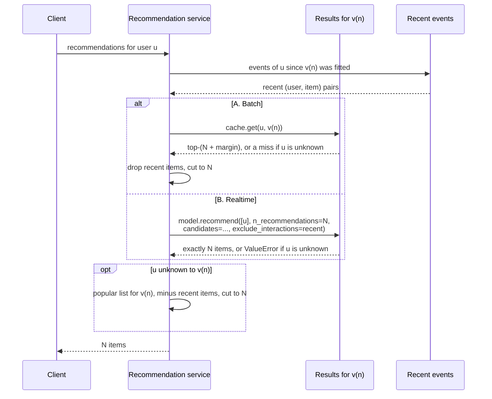

<!-- Generated from README.md.j2 by `python benchmarks/run.py render`: edit the template, not this file. -->
# skrecsys

[](https://pypi.org/project/skrecsys/)
[](https://pypi.org/project/skrecsys/)
[](LICENSE)

Recommender systems in the scikit-learn style, built on NumPy, SciPy and scikit-learn.

Every model has the same `fit`, `partial_fit`, `recommend` and `predict` interface, and
works with scikit-learn's model selection tools. Around the models, skrecsys provides
top-k ranking and beyond-accuracy metrics, a cross-validation splitter that keeps every
test user and item in training, dataset loaders, and approximate nearest-neighbour
indexes for large catalogs. The models are classical collaborative filtering (item kNN,
BM25, RP3beta, EASE, SLIM, ALS, BPR) plus graph-based and sequential neural recommenders
(SimpleX, XSimGCL, HSTU, Mamba4Rec).

The estimators are Python; the inner loops are not. The similarity kernels, the
elastic-net and least-squares solvers, the BPR sampler, identifier encoding, sparse
matrix assembly and top-k selection are all written in Rust and exposed through PyO3 as
`skrecsys._core`. They parallelize with [rayon](https://github.com/rayon-rs/rayon) and
release the GIL while they run, and every recommender in `skrecsys.recommendation`
scores and ranks a batch of queries inside one kernel, without ever materializing a dense
score matrix in NumPy. The hot loops are written for the auto-vectorizer and use fused
multiply-add where the hardware has it — NEON on Apple silicon and other aarch64, AVX2
and FMA on x86-64 through runtime dispatch. Nothing in the crate uses `unsafe`, and both
crates `#![forbid(unsafe_code)]` so it stays that way.

The installed library is small: four runtime dependencies, all of them ones a
scikit-learn user already has — NumPy, SciPy, scikit-learn and joblib, plus
`typing-extensions` on Python 3.11 only. pandas is optional, and only needed for the
dataset loaders' `as_frame=True`.

## Installation

```sh
pip install skrecsys
```

or with [uv](https://docs.astral.sh/uv/):

```sh
uv add skrecsys
```

Requires Python 3.11+, on Linux, macOS or Windows. The wheels carry the compiled
extension, so installing needs no Rust toolchain; they are built against the stable ABI,
which means one wheel per platform covers every supported interpreter. Building from a
source checkout needs a Rust toolchain and [maturin](https://www.maturin.rs/).

Two optional extras add dependencies the core does not need:

```sh
pip install skrecsys[pandas]   # `as_frame=True` on the dataset loaders
pip install skrecsys[nn]       # PyTorch, for the recommenders in `skrecsys.nn`
```

`skrecsys.nn` raises an `ImportError` naming the extra when torch is missing; everything
else works without it. Torch is needed to *fit* a neural recommender, not to use one: a
fitted model holds nothing but numpy arrays, so it scores, pickles and unpickles in an
environment that has no torch installed.

## Usage

Training data `X` has exactly two columns: user identifiers in column 0 and item
identifiers in column 1. Each row is one interaction. For ordinary recommenders the rows
are an unordered set of interactions, so their order does not matter. An optional `y`
array carries the interaction value (such as a rating or confidence) for each row; it is
separate from `X` and must have the same number of rows. This layout also applies when
`X` is a pandas DataFrame: the first two columns are used in order, regardless of their
column names.

Every recommender in `skrecsys.recommendation` and `skrecsys.nn` has the same four
methods:

```python
import numpy as np

from skrecsys.recommendation import ItemKNNRecommender

X = np.array(
    [
        ["alice", "matrix"],
        ["alice", "alien"],
        ["bob", "matrix"],
        ["bob", "blade runner"],
        ["carol", "alien"],
        ["carol", "blade runner"],
        ["carol", "heat"],
    ]
)

# fit: learn from interactions
rec = ItemKNNRecommender().fit(X)

# recommend: top-k items per user, best first; items a user already has are left out
items, scores = rec.recommend(["alice", "bob"], n_recommendations=2)
# items  -> [["blade runner", "heat"], ["alien", "heat"]]
# scores -> [[1.0, 0.707], [1.0, 0.707]]

# predict: the score of given user-item pairs
rec.predict([["alice", "blade runner"], ["bob", "heat"]])  # -> [1.0, 0.707]

# partial_fit: add a new batch without refitting; new users and items are fine
rec.partial_fit([["dave", "heat"], ["dave", "alien"], ["alice", "blade runner"]])
rec.recommend(["alice", "dave"], n_recommendations=1)[0]  # -> [["heat"], ["blade runner"]]

# also skip pairs the model hasn't been updated with yet, such as items just shown
rec.recommend(["dave"], n_recommendations=1, exclude_interactions=[["dave", "blade runner"]])[0]
# -> [["matrix"]]
```

- `fit(X, y=None)` learns from scratch. `y` is optional: one rating or weight per row.
- `recommend(users, n_recommendations=k)` returns two `(n_users, k)` arrays: item IDs
  and their scores. Only users seen by `fit` or `partial_fit` can be queried.
  `candidates=` limits the ranking to some items, `exclude_seen=False` keeps a user's own
  items, and `exclude_interactions=` removes further user-item pairs.
- `predict(pairs)` scores given `(user, item)` pairs, both of which the model has seen.
- `partial_fit(X, y=None)` adds a batch to what the model knows. See
  [incremental fitting](#incremental-fitting) for which models reproduce `fit` exactly
  and which continue from where they stopped.

How these calls divide between training jobs and a serving process is covered under
[production lifecycle](#production-lifecycle).

### Model selection

Recommenders are scikit-learn estimators, so `GridSearchCV` and `cross_validate` work on
them. `WarmStartKFold` splits interactions so that every user and item in a test fold also
appears in its training fold, and `make_recommender_scorer` turns a top-k metric into a
scorer:

```python
from sklearn.model_selection import GridSearchCV

from skrecsys.datasets import fetch_movielens_100k
from skrecsys.metrics import make_recommender_scorer, ndcg_at_k
from skrecsys.model_selection import WarmStartKFold

X, y = fetch_movielens_100k(return_X_y=True)
search = GridSearchCV(
    ItemKNNRecommender(),
    {"n_neighbors": [10, 50, 200], "shrink": [0.0, 10.0]},
    cv=WarmStartKFold(n_splits=5, shuffle=True, random_state=0),
    scoring=make_recommender_scorer(ndcg_at_k, k=10),
).fit(X)
```

## Production lifecycle

[Usage](#usage) shows each call on its own. This section is about how `fit`, `partial_fit`
and `recommend` fit together in a running system: which process makes each call, when, and
what gets cached.

### Roles and serving modes

A deployment has three jobs, and they should not share a live object:

- the **trainer** calls `fit` on a window of the interaction log;
- the **updater** calls `partial_fit` on micro-batches of new events;
- the **recommendation service** answers requests.

What passes between them is a pickled, versioned model. Every fitted estimator pickles,
index included, and a `skrecsys.nn` model unpickles and scores without torch installed.

The service gets its answers in one of two ways, and a deployment picks **one**:

- **A. Batch.** A job calls `recommend` for every user after each new version and writes the
  results to a key-value cache. The service only looks results up and never loads a model.
- **B. Realtime.** Each service replica holds the model in memory, swaps to every new
  version atomically, and calls `recommend` on the request path. There is no per-user
  result cache.



Neither mode calls `partial_fit` on a model that is serving requests. `partial_fit` updates
the model in place and rebinds `user_ids_`, `item_ids_`, `interactions_` and the fitted arrays
one after another, so a `recommend` running at the same time can read a vocabulary from
one version and a matrix from the other. The updater works on its own copy and publishes
a new version, which the batch job reads (A) or each replica swaps to in one step (B).

### When to `fit`

A full `fit` is the baseline that everything else is measured against. Run it:

- **on a schedule** (nightly or weekly, whichever the fit time allows) over a *window* of
  the log, not all of history;
- **after any hyperparameter change**, because nothing incremental can apply one;
- **to forget.** `partial_fit` only adds. It never decays, expires or deletes an interaction,
  so removing an old interaction, handling a deletion request, or stopping
  `interactions_` from growing forever all take a refit;
- **to reset drift** in the estimators whose `partial_fit` is a warm start (table below).

Choose hyperparameters offline with `WarmStartKFold`. When the real decision is ordered in
time (training on the past, serving the future), a random split of interactions
overestimates the score, so hold out the last period instead when you judge a
configuration.

### When to `partial_fit`

Between refits, `partial_fit` brings new users, new items and new interactions into the
model. Call it on **micro-batches** (every few minutes to every hour), not once per event,
because every call pays fixed costs that do not shrink with the batch:

- an `index` is rebuilt from scratch at the end of every call;
- `interactions_` is rebuilt in full whenever a new identifier sorts *before* an existing one
  and renumbers the codes. Identifiers that only ever increase (sequence numbers, time-ordered
  UUIDs) keep that relabelling off;
- a neighbourhood model recomputes every row within two hops of the batch, and a popular
  item puts most of the catalog within two hops.

| Estimator | After `partial_fit` | Cost that grows with the batch | Refit needed for |
| --- | --- | --- | --- |
| `MostPopularRecommender` | exact | the batch | forgetting |
| `ItemKNNRecommender`, `RP3Beta` | exact | rows two hops from the batch | forgetting |
| `BM25Recommender` | exact | usually the whole catalog (corpus-wide statistics) | forgetting |
| `EASE` | exact | `O(n_items² · users touched)`, plus a second dense item×item matrix | forgetting, memory |
| `SLIMElasticNet` | warm start | coordinate descent on reachable columns, plus `gram_` | drift, forgetting |
| `AlternatingLeastSquares`, `BayesianPersonalizedRanking` | warm start | resumed sweeps / descent | drift, forgetting |
| `skrecsys.nn` models | warm start | resumed training on the grown data | drift, forgetting |

"Exact" means the model after `partial_fit` is the one `fit` on the concatenated batches would
have produced, so for those estimators the scheduled refit exists only to forget. "Warm
start" means the model continues from where it stopped and gradually drifts from a fresh
fit, so the refit also corrects that drift.



### Choosing the mode

`recommend` is built for batches. It ranks queries a block at a time inside one kernel,
and ranking every MovieLens-100K user against the whole catalog takes about a
millisecond (see [the leaderboard](#leaderboard)). Two properties of the API decide which
mode fits:

- `recommend` accepts **only users the model has seen**. An unknown user raises
  `ValueError`, for every estimator, `MostPopularRecommender` included;
- `candidates=` restricts the ranking to a set of items **shared by the whole call**. A
  batch job cannot know a request's candidates in advance, so per-request eligibility (in
  stock, region, category, page) is only possible in realtime;
- `exclude_interactions=` removes user-item pairs **per query**: the events a user produced
  after the model was fitted. Pass them as they are, in the layout of `fit`'s `X`. Pairs for
  other users or for items the model doesn't know are ignored. A batch job can only exclude
  what has already happened when it runs; a realtime call excludes what has happened by
  the time of the request.

**Batch** fits when every request for a user gets the same list and most users come back
between versions. The job passes the events that arrived after the version was fitted as
`exclude_interactions`, so each list starts fresh. Events that arrive after the job ran
still have to be filtered out at lookup time, so set `n_recommendations` above what a page
shows to leave enough items after filtering. Key the cache by `(user, model_version)` so that a new version
replaces every entry at once, and never mix lists from two versions: their scores are on
different scales. How fresh the results are depends on how long the batch job takes, since
a version is not live until its job finishes.

**Realtime** fits when eligibility depends on the request, or when the user base is large
and mostly inactive, so computing lists for everyone wastes work. Each replica loads the
pickle once and never refits at startup. Each call passes the user's recent events as
`exclude_interactions`, so it returns exactly the number of fresh items asked for, with no
over-fetching and no filtering afterwards. Replicas should batch concurrent requests into
one `recommend` call; the pairs of every user in the batch can go in together. On large catalogs an `index` makes each call cheaper, but see
[vector indexes](#vector-indexes) for what it costs in exactness and speed first.



### The request path

Both modes read the user's recent events and fall back to a popular list for unknown
users. They differ in where the recent events are applied: inside `recommend` (realtime),
or to a list computed earlier (batch).



A user unknown to the model gets a popular list that does not depend on the user. Compute
it once per version, either with `MostPopularRecommender` ranking any known user with
`exclude_seen=False` or directly from the counts. The batch job writes it to the cache under
its own key (A), and a realtime replica keeps it in memory next to the model (B).

The recent events close a freshness gap that `exclude_seen` cannot. `exclude_seen` filters
against `interactions_` as the model saw it, so without them anything the user took after
the snapshot stays eligible until the next `partial_fit`. The store only needs to hold events
newer than the serving version: once `partial_fit` has taken them in, `exclude_seen` covers
them. The same store holds events from users who are new since the snapshot, and those
users get the fallback until the next update adds them.

### Responsibilities of the serving layer

A model object ranks and scores. These parts of a deployment belong to the service around it:

- **Unknown users.** `recommend` raises `ValueError` for a user the model has not seen; the
  service serves the popular fallback above.
- **Anonymous sessions.** The classical estimators score users by identifier, so a session
  becomes rankable once `partial_fit` has taken in its events.
- **Retention.** `partial_fit` only adds interactions; time decay, windows and deletion
  requests are applied by refitting on the chosen window.
- **Concurrency.** A model is updated as a snapshot and swapped in, never mutated while it
  serves.
- **Versioning.** The model store records each version and the window it was fitted on.

## Datasets

Loaders download public datasets once, cache them in `~/skrecsys_data` (override with
`data_home=` or `SKRECSYS_DATA`) and return them as `(user_id, item_id)` pairs plus ratings,
like `sklearn.datasets`.

```python
from sklearn.model_selection import cross_validate

from skrecsys.datasets import fetch_movielens_100k

X, y = fetch_movielens_100k(return_X_y=True)
cross_validate(
    ItemKNNRecommender(),
    X,
    y,
    cv=WarmStartKFold(n_splits=5, shuffle=True, random_state=0),
    scoring=make_recommender_scorer(ndcg_at_k, k=10),
)

# official u1-u5 / ua / ub splits, timestamps and user/movie metadata
ml = fetch_movielens_100k(subset="u1")
cross_validate(
    ItemKNNRecommender(),
    ml.data,
    ml.target,
    cv=[(ml.train_indices, ml.test_indices)],
    scoring=make_recommender_scorer(ndcg_at_k, k=10),
)
```

`fetch_movielens_1m` is the same shape one size up, and the dataset the sequential
benchmark runs on: a million ratings from 6,040 users, unfiltered and with MovieLens's own
identifiers. With `subset="leave-one-out"` and `max_sequence_length=200` it is the
`ml-1m-l200` that HSTU and SASRec publish numbers on.

```python
from skrecsys.datasets import fetch_movielens_1m

ml = fetch_movielens_1m(subset="leave-one-out", max_sequence_length=200)
ml.train_indices, ml.test_indices  # all but each user's last rating, and that rating
```

Amazon Books arrives preprocessed the way the sequential-recommendation literature uses
it — the 5-core of the 2014 review dump, chronological, cut to a 50-interaction history
per user — so it is the `amzn-books-l50` that HSTU and SASRec publish numbers on.

```python
from skrecsys.datasets import fetch_amazon_books

books = fetch_amazon_books(subset="leave-one-out")  # 8.1M interactions, 695k items
books.data, books.target, books.timestamps  # pairs, ratings, Unix seconds
books.item_info.asin[books.data[0, 1]]  # the product behind an item id

full = fetch_amazon_books(max_sequence_length=None)  # 10.1M, every 5-core interaction
```

The first call downloads ~900 MB and spends about half a minute and ~6 GB of memory
parsing it; afterwards it loads from the cache in seconds, and changing
`max_sequence_length` re-parses nothing. `subset="leave-one-out"` holds out each user's
last interaction, the protocol those papers evaluate with, and keeps one extra history
slot so the held-out interaction is predicted from a full window.

`as_frame=True` returns pandas objects and requires `pip install skrecsys[pandas]`.

## Sequential recommendation

`skrecsys.nn.HSTU` and `skrecsys.nn.Mamba4Rec` predict what a user does *next* rather
than what they like. Their `X` still has exactly two columns — user ID first, item ID
second — but row order is now significant: within a user, row `i` precedes row `j`
whenever `i < j`. If you have timestamps, sort by user and timestamp before fitting;
timestamps are not passed as a third column or used by these models. Rows of different
users may be interleaved. Every loader here already sorts its rows by user and then by
time, so its output is ready to fit, but shuffling the rows first trains the models on
an incorrect sequence they cannot detect.

```python
from skrecsys.nn import HSTU, Mamba4Rec

ml = fetch_movielens_1m(subset="leave-one-out", max_sequence_length=200)
hstu = HSTU(random_state=0).fit(ml.data[ml.train_indices])
items, scores = hstu.recommend(ml.data[ml.test_indices][:, 0], n_recommendations=10)

mamba = Mamba4Rec(random_state=0).fit(ml.data[ml.train_indices])
```

The two read a history in different ways. HSTU attends over the window, so every position
is compared against every other and the cost grows with the square of
`max_sequence_length`; Mamba4Rec runs a selective state space recurrence over it, which
carries a fixed-size state from one position to the next and costs the same per position
however long the window is.

Either one scores from the history it was fitted on: `recommend` takes user identifiers,
not sequences. Two differences from the published models: HSTU also biases
attention by the *time* gaps between interactions, and `fit` receives identifiers only,
so this one carries the positional half of that bias alone. Mamba4Rec's recurrence is
plain PyTorch rather than the fused CUDA kernel of `mamba-ssm`: the arithmetic is the
same, the constant factor is not, so a fit is expensive and the paper's efficiency claims
cannot be checked against it.

Because a fit is expensive, both take a `device`. It defaults to `"cpu"`, the one backend
every wheel has, and `device="auto"` picks CUDA, then MPS, then CPU — which is what
`benchmarks/config/sequential.json` and the benchmark tests fit with, so they use whatever
accelerator the host has:

```python
mamba = Mamba4Rec(random_state=0, device="auto").fit(ml.data[ml.train_indices])
```

The seeded batch order and dropout masks are drawn on the CPU whatever the device is, so
moving a fit to an accelerator changes the last floating point digits of the result and
nothing else.

Every `skrecsys.nn` model shares one training loop, and it watches the training loss. An
epoch that fails to beat the best loss so far by `tol` counts as a stall; after
`n_iter_no_change` of them the `"adaptive"` schedule divides the Adam step size by five,
and once the step size has bottomed out `early_stopping` ends the fit. `n_iter_` reports
the epochs actually run and `best_loss_` the lowest loss reached. Pass
`early_stopping=False, learning_rate_schedule="constant"` for the plain fixed-budget loop:

```python
hstu = HSTU(random_state=0, early_stopping=False, learning_rate_schedule="constant")
```

The signal is the training loss, not a held-out split, so this ends a fit that has
converged rather than one that has begun to overfit — catching that would mean holding
interactions back from `fit`. In practice it fires rarely at these defaults: measured on
`ml-1m`, HSTU's loss goes at most one epoch without improving across a hundred of them,
so its fit is untouched.

## Leaderboard

### MovieLens 100K

MovieLens 100K, official `ua` split, k=10, default hyper-parameters. Regenerate with `python benchmarks/run.py run leaderboard --dataset movielens-100k`.

| Model | NDCG@10 | P@10 | R@10 | hit rate | MAP | MRR | cat cov | user cov | mean pop | novelty |
| --- | --- | --- | --- | --- | --- | --- | --- | --- | --- | --- |
| SLIM | 0.3024 | 0.2558 | 0.2558 | 0.9226 | 0.1621 | 0.6418 | 0.2226 | 1.0000 | 247.5139 | 8.65 |
| XSimGCL | 0.2931 | 0.2556 | 0.2556 | 0.9332 | 0.1540 | 0.6054 | 0.4458 | 1.0000 | 206.4415 | 9.05 |
| BPR | 0.2800 | 0.2467 | 0.2467 | 0.9226 | 0.1451 | 0.5782 | 0.3542 | 1.0000 | 228.5243 | 8.84 |
| EASE | 0.2767 | 0.2382 | 0.2382 | 0.9035 | 0.1444 | 0.5888 | 0.3030 | 1.0000 | 228.8724 | 8.79 |
| RP3Beta | 0.2762 | 0.2407 | 0.2407 | 0.9215 | 0.1414 | 0.5911 | 0.2417 | 1.0000 | 235.4201 | 8.78 |
| BM25 | 0.2661 | 0.2292 | 0.2292 | 0.8918 | 0.1370 | 0.5788 | 0.1024 | 1.0000 | 293.0034 | 8.36 |
| ItemKNN | 0.2550 | 0.2200 | 0.2200 | 0.9173 | 0.1268 | 0.5624 | 0.2887 | 1.0000 | 217.0530 | 8.86 |
| SimpleX | 0.2467 | 0.2137 | 0.2137 | 0.8388 | 0.1267 | 0.5336 | 0.3315 | 1.0000 | 222.2856 | 8.96 |
| MostPopular | 0.1331 | 0.1215 | 0.1215 | 0.7306 | 0.0545 | 0.3218 | 0.0530 | 1.0000 | 371.7549 | 7.97 |
| ALS | 0.0422 | 0.0408 | 0.0408 | 0.3160 | 0.0144 | 0.1119 | 0.1464 | 1.0000 | 155.0729 | 10.09 |

Measured on more than one host, so compare timings only between rows that share one. SLIM, BPR, EASE, RP3Beta, BM25, ItemKNN, MostPopular, ALS: Apple M4 Pro (12 usable cores), macOS-26.7-arm64-arm-64bit-Mach-O, CPython 3.14.3, numpy 2.5.3, skrecsys 0.4.0, `_core` built in release mode. XSimGCL, SimpleX: Apple M4 Pro (12 usable cores), macOS-26.6.2-arm64-arm-64bit-Mach-O, CPython 3.14.3, numpy 2.5.3, skrecsys 0.4.0, `_core` built in release mode. The quality table above is deterministic and portable; the timings below are not comparable across machines or builds.

Wall clock per call. Each operation is sampled until it has spent 20s or reached its cap (1000 fits, 1000 `recommend` calls), after untimed warm-up calls (1 fit, 10 rank) so that no sample pays for a cold start; the `samples` columns say how many each row actually got, which is why a slow model shows fewer. The batch columns say what a single call processed: one fit covers the whole training split, and one `recommend` call ranks the entire catalog for every held-out user at once, so these are throughput numbers rather than single-request latency. Fit reports the spread a handful of samples can resolve; ranking is sampled often enough for nearest-rank quantiles, each of which is a call that really happened. Compare `min` across machines and watch `max` for the variance a run saw.

| Model | fit batch (interactions) | fit samples | fit min | fit median | fit max | rank batch (users x items) | rank samples | rank mean | rank median | rank q95 | rank q99 |
| --- | --- | --- | --- | --- | --- | --- | --- | --- | --- | --- | --- |
| SLIM | 90570 | 111 | 164 ms | 179 ms | 231 ms | 943 x 1680 | 1000 | 1 ms | 1 ms | 1 ms | 1 ms |
| XSimGCL | 90570 | 3 | 457.64 s | 505.34 s | 621.14 s | 943 x 1680 | 1000 | 1 ms | 1 ms | 1 ms | 1 ms |
| BPR | 90570 | 16 | 1.30 s | 1.31 s | 1.32 s | 943 x 1680 | 1000 | 1 ms | 1 ms | 1 ms | 1 ms |
| EASE | 90570 | 710 | 26 ms | 28 ms | 33 ms | 943 x 1680 | 1000 | 3 ms | 3 ms | 3 ms | 4 ms |
| RP3Beta | 90570 | 1000 | 8 ms | 8 ms | 18 ms | 943 x 1680 | 1000 | 1 ms | 1 ms | 1 ms | 1 ms |
| BM25 | 90570 | 1000 | 6 ms | 7 ms | 9 ms | 943 x 1680 | 1000 | 1 ms | 1 ms | 1 ms | 1 ms |
| ItemKNN | 90570 | 1000 | 5 ms | 6 ms | 7 ms | 943 x 1680 | 1000 | 1 ms | 1 ms | 1 ms | 1 ms |
| SimpleX | 90570 | 3 | 130.37 s | 134.37 s | 139.83 s | 943 x 1680 | 1000 | 1 ms | 1 ms | 1 ms | 1 ms |
| MostPopular | 90570 | 1000 | 1 ms | 1 ms | 1 ms | 943 x 1680 | 1000 | 1 ms | 1 ms | 1 ms | 1 ms |
| ALS | 90570 | 60 | 324 ms | 326 ms | 444 ms | 943 x 1680 | 1000 | 1 ms | 1 ms | 1 ms | 1 ms |

Every model uses its default hyper-parameters, so this ranks the library's baselines,
not the best each method can do. `R@10` equals `P@10` because the `ua` split holds out
exactly 10 items per user, and `user cov` is 1 by construction: `recommend` raises
rather than return a short list. The beyond-accuracy columns are the interesting ones —
`MostPopular` has the highest `mean pop` and the lowest `novelty`, and `BM25` buys its
ranking score by covering a tenth of the catalog where `EASE` covers a third. `SLIM`
leads on every ranking metric while keeping a fifth of the catalog reachable, at a
similarity matrix a quarter as dense as `RP3Beta`'s. `BPR` is the only model here
trained on pairwise preferences rather than fitted in closed form, and it buys the
second-best ranking with the widest catalog coverage of all; it is also the slowest to
fit, and the entry is seeded, which pins it to a single thread.

The second table times the same runs. Both operations are batched — one fit over the
whole training split, one `recommend` call scoring all 943 held-out users against all
1680 items the model saw — so these are throughput numbers, and the per-request latency
of a single user is a different measurement. Ranking separates the models by what they
have to touch rather than by how good they are. Every model goes through a kernel that
scores a query, drops what the user has seen and keeps the best ten before moving on, so
no score matrix is ever built: the neighbourhood models accumulate only the items a
query reaches, the factor models scan the catalog a tile of users at a time, and both
finish in about 1 ms. `EASE` is the slowest at 3 ms because its similarity matrix is
dense, so every item a user has seen adds a full catalog-wide row to their scores. The
`max` column is where a run's variance shows — `RP3Beta` fits in 8 ms at the median but
18 ms at its slowest sample. How many samples a row gets is the budget's doing, which is
why `BPR` at 1.3 s a fit gets sixteen and `MostPopular` gets its full thousand;
`--budget` and `--repeat` buy more.

### Amazon Books

Amazon Books (`amzn-books-l50`), `leave-one-out` split, k=10, default hyper-parameters. Scored on a fixed random sample of 10,000 held-out users. Not run: EASE (a dense 674k x 674k item matrix does not fit in memory); SLIM (one elastic net per item over a 674k-item catalog does not finish); SimpleX (one training epoch of 7.4M interactions runs over an hour on CPU); XSimGCL (one training epoch of 7.4M interactions runs over an hour on CPU). Regenerate with `python benchmarks/run.py run leaderboard --dataset amazon-books`.

| Model | NDCG@10 | P@10 | R@10 | hit rate | MAP | MRR | cat cov | user cov | mean pop | novelty |
| --- | --- | --- | --- | --- | --- | --- | --- | --- | --- | --- |
| BM25 | 0.0466 | 0.0078 | 0.0777 | 0.0777 | 0.0370 | 0.0370 | 0.1034 | 1.0000 | 52.9699 | 18.43 |
| ItemKNN | 0.0364 | 0.0060 | 0.0603 | 0.0603 | 0.0291 | 0.0291 | 0.1158 | 1.0000 | 63.6760 | 20.12 |
| RP3Beta | 0.0247 | 0.0045 | 0.0452 | 0.0452 | 0.0184 | 0.0184 | 0.1227 | 1.0000 | 32.6864 | 20.45 |
| BPR | 0.0075 | 0.0015 | 0.0151 | 0.0151 | 0.0052 | 0.0052 | 0.0160 | 1.0000 | 753.6300 | 14.20 |
| MostPopular | 0.0037 | 0.0008 | 0.0079 | 0.0079 | 0.0025 | 0.0025 | 0.0000 | 1.0000 | 4092.8595 | 10.99 |
| ALS | 0.0000 | 0.0000 | 0.0001 | 0.0001 | 0.0000 | 0.0000 | 0.0005 | 1.0000 | 132.8660 | 20.73 |

Measured on Apple M4 Pro (12 usable cores), macOS-26.7-arm64-arm-64bit-Mach-O, CPython 3.14.3, numpy 2.5.3, skrecsys 0.4.0, `_core` built in release mode. The quality table above is deterministic and portable; the timings below are not comparable across machines or builds.

Wall clock per call. Each operation is sampled until it has spent 60s or reached its cap (5 fits, 50 `recommend` calls), after untimed warm-up calls (1 fit, 2 rank) so that no sample pays for a cold start; the `samples` columns say how many each row actually got, which is why a slow model shows fewer. The batch columns say what a single call processed: one fit covers the whole training split, and one `recommend` call ranks the entire catalog for every held-out user at once, so these are throughput numbers rather than single-request latency. Fit reports the spread a handful of samples can resolve; ranking is sampled often enough for nearest-rank quantiles, each of which is a call that really happened. Compare `min` across machines and watch `max` for the variance a run saw.

| Model | fit batch (interactions) | fit samples | fit min | fit median | fit max | rank batch (users x items) | rank samples | rank mean | rank median | rank q95 | rank q99 |
| --- | --- | --- | --- | --- | --- | --- | --- | --- | --- | --- | --- |
| BM25 | 7374280 | 5 | 566 ms | 600 ms | 604 ms | 10000 x 660940 | 50 | 22 ms | 22 ms | 27 ms | 34 ms |
| ItemKNN | 7374280 | 5 | 573 ms | 598 ms | 605 ms | 10000 x 660940 | 50 | 45 ms | 46 ms | 51 ms | 53 ms |
| RP3Beta | 7374280 | 5 | 1.63 s | 1.67 s | 1.70 s | 10000 x 660940 | 50 | 36 ms | 35 ms | 43 ms | 50 ms |
| BPR | 7374280 | 3 | 312.95 s | 313.07 s | 313.21 s | 10000 x 660940 | 16 | 3.81 s | 3.88 s | 3.94 s | 3.94 s |
| MostPopular | 7374280 | 5 | 132 ms | 133 ms | 137 ms | 10000 x 660940 | 50 | 595 ms | 595 ms | 610 ms | 627 ms |
| ALS | 7374280 | 3 | 64.91 s | 65.12 s | 65.19 s | 10000 x 660940 | 50 | 979 ms | 988 ms | 1.06 s | 1.08 s |

## Sequential benchmark

A different question, and so a different table: each user's last interaction is held out,
the model reads the 200 before it, and the held-out item is ranked against the whole
catalog. This is the leave-one-out protocol the sequential-recommendation literature
reports on, which is what `skrecsys.nn.HSTU` is built for and what the numbers in the
HSTU and SASRec papers can be read against. It is **not** comparable with the leaderboard
above, which splits interactions rather than predicting the next one.

```sh
uv run python benchmarks/run.py run sequential --dry-run   # say what is out of date
uv run python benchmarks/run.py run sequential             # measure it, re-render the table below
```

MovieLens 1M (`ml-1m-l200`), `leave-one-out` split, default hyper-parameters. Each user's last interaction is held out and ranked against the whole catalog, with the items they already saw removed. Not run: SimpleX (one fit of 1M interactions runs for hours on CPU); XSimGCL (one fit of 1M interactions runs for hours on CPU). Regenerate with `python benchmarks/run.py run sequential --dataset movielens-1m`.

Not yet measured: Mamba4Rec.

| Model | HR@10 | NDCG@10 | HR@50 | NDCG@50 | HR@200 | NDCG@200 | cat cov@10 |
| --- | --- | --- | --- | --- | --- | --- | --- |
| HSTU | 0.2871 | 0.1665 | 0.5432 | 0.2229 | 0.7425 | 0.2533 | 0.6221 |
| EASE | 0.0892 | 0.0437 | 0.2520 | 0.0788 | 0.4917 | 0.1150 | 0.3738 |
| SLIM | 0.0825 | 0.0413 | 0.2510 | 0.0775 | 0.4912 | 0.1135 | 0.1843 |
| BPR | 0.0714 | 0.0350 | 0.2459 | 0.0721 | 0.5402 | 0.1162 | 0.4907 |
| ItemKNN | 0.0714 | 0.0368 | 0.2306 | 0.0709 | 0.5111 | 0.1128 | 0.3733 |
| BM25 | 0.0642 | 0.0334 | 0.2096 | 0.0644 | 0.4526 | 0.1007 | 0.1338 |
| RP3Beta | 0.0639 | 0.0323 | 0.2207 | 0.0656 | 0.4892 | 0.1058 | 0.3744 |
| MostPopular | 0.0315 | 0.0151 | 0.1248 | 0.0346 | 0.3159 | 0.0630 | 0.0137 |
| ALS | 0.0182 | 0.0081 | 0.0604 | 0.0170 | 0.1555 | 0.0311 | 0.1226 |

Measured on more than one host, so compare timings only between rows that share one. HSTU: Apple M4 Pro (12 usable cores), macOS-26.6.2-arm64-arm-64bit-Mach-O, CPython 3.14.3, numpy 2.5.3, skrecsys 0.4.0, `_core` built in release mode. EASE, SLIM, BPR, ItemKNN, BM25, RP3Beta, MostPopular, ALS: Apple M4 Pro (12 usable cores), macOS-26.7-arm64-arm-64bit-Mach-O, CPython 3.14.3, numpy 2.5.3, skrecsys 0.4.0, `_core` built in release mode. The sequential models ran with `device="auto"`, which resolved to MPS on this host (torch 2.14.0); every other model is CPU only. The quality table above is deterministic and portable; the timings below are not comparable across machines or builds.

Wall clock per call. Each operation is sampled until it has spent 30s or reached its cap (1 fits, 5 `recommend` calls), after untimed warm-up calls (0 fit, 1 rank) so that no sample pays for a cold start; the `samples` columns say how many each row actually got, which is why a slow model shows fewer. The batch columns say what a single call processed: one fit covers the whole training split, and one `recommend` call ranks the entire catalog for every held-out user at once, so these are throughput numbers rather than single-request latency. Fit reports the spread a handful of samples can resolve; ranking is sampled often enough for nearest-rank quantiles, each of which is a call that really happened. Compare `min` across machines and watch `max` for the variance a run saw.

| Model | fit batch (interactions) | fit samples | fit min | fit median | fit max | rank batch (users x items) | rank samples | rank mean | rank median | rank q95 | rank q99 |
| --- | --- | --- | --- | --- | --- | --- | --- | --- | --- | --- | --- |
| HSTU | 656566 | 1 | 1297.60 s | 1297.60 s | 1297.60 s | 6040 x 3646 | 5 | 42 ms | 42 ms | 43 ms | 43 ms |
| EASE | 656566 | 1 | 239 ms | 239 ms | 239 ms | 6040 x 3646 | 5 | 83 ms | 83 ms | 84 ms | 84 ms |
| SLIM | 656566 | 1 | 214 ms | 214 ms | 214 ms | 6040 x 3646 | 5 | 23 ms | 22 ms | 25 ms | 25 ms |
| BPR | 656566 | 1 | 11.21 s | 11.21 s | 11.21 s | 6040 x 3646 | 5 | 32 ms | 32 ms | 33 ms | 33 ms |
| ItemKNN | 656566 | 1 | 33 ms | 33 ms | 33 ms | 6040 x 3646 | 5 | 25 ms | 25 ms | 26 ms | 26 ms |
| BM25 | 656566 | 1 | 40 ms | 40 ms | 40 ms | 6040 x 3646 | 5 | 16 ms | 16 ms | 17 ms | 17 ms |
| RP3Beta | 656566 | 1 | 43 ms | 43 ms | 43 ms | 6040 x 3646 | 5 | 24 ms | 24 ms | 25 ms | 25 ms |
| MostPopular | 656566 | 1 | 9 ms | 9 ms | 9 ms | 6040 x 3646 | 5 | 22 ms | 22 ms | 23 ms | 23 ms |
| ALS | 656566 | 1 | 2.50 s | 2.50 s | 2.50 s | 6040 x 3646 | 5 | 24 ms | 24 ms | 25 ms | 25 ms |

HSTU wins by a factor of three over the best non-sequential model here, which is the
point of the table: on this split the answer depends on what a user watched *most
recently*, and a model that reads their history as an unordered bag cannot use that. The
ordering underneath is worth reading too — `EASE` and `SLIM`, the two models that solve
for an item-item matrix in closed form, beat the neighbourhood models, and `ALS` at eight
factors comes last, below even `MostPopular`.

For scale, the HSTU authors report HR@10 0.3097 / NDCG@10 0.1720 for HSTU on this dataset
and 0.2853 / 0.1603 for SASRec. This implementation lands at 0.2871 / 0.1665: between the
two, about 7% under published HSTU on HR@10 and 3% under on NDCG@10. That gap is the
expected size and direction, because the relative attention bias here carries positions
only — the published model also buckets the *time* gaps between interactions, which `fit`
never sees. The result confirms that the block, the causal masking and the sampled softmax behave as
published.

The cost is the other half of the story. One HSTU fit is 22 minutes against 33 ms for
`ItemKNN` — some 40,000 times more compute for three times the hit rate, on a CPU and
without the fused kernels the paper uses. Scoring, on the other hand, is a dot product
against a precomputed state, so a fitted HSTU ranks the catalog for all 6,040 users in
42 ms, in the same range as the classical models (16–32 ms, and 83 ms for `EASE`).

Every score is an order of magnitude below the MovieLens table, and that is the dataset
rather than the models: one held-out interaction per user over a 661k-item catalog,
where MovieLens holds out ten out of 1682. `R@10` equals the hit rate for the same
reason — a single relevant item is either in the list or not — and `P@10` is that hit
rate over ten. For scale, the HSTU authors report HR@10 0.0416 / NDCG@10 0.0227 for HSTU
and 0.0306 / 0.0164 for SASRec on this dataset. Those are close enough in protocol to be
worth quoting — leave-one-out, full-corpus ranking, seen items filtered — but they were
not produced by this harness, so compare them with the rows above with care: the candidate set here is the 660,940 items seen in
training rather than the full 695,762-item space, and the rows are scored on a 10,000-user
sample.

Ranking order changes completely. `BM25` leads, the neighbourhood models take the top
three places, and the two models fitted by gradient descent collapse: `BPR` scores a
fifth of `BM25` while recommending the head of the catalog (`mean pop` 754 against 53),
and `ALS` at its default eight factors is indistinguishable from noise. Both defaults
were chosen against a 1.7k-item catalog and neither has the capacity for this one; they
are not evidence about the methods, only about the defaults. `MostPopular` is the reference
baseline of a long-tailed catalog — its catalog coverage rounds to zero, because ten
items out of 660,940 is what a global ranking can reach.

The timing table shows where sparsity pays. A catalog 400 times larger costs the
neighbourhood models about a hundred times their MovieLens fit (0.6 s for `BM25`) because
the item-item work follows co-occurrences rather than catalog size, and ranking 10,000
users against all 660,940 items takes 22–46 ms. The models that score every item for
every user pay for the catalog instead: `MostPopular` inverts the usual order at 0.6 s
per call, with nothing to fit and no structure to exploit, and the factor models rank in
1 s (`ALS`, eight factors) and 3.9 s (`BPR`, sixty-four). `BPR` is also the slowest to
fit at 5 minutes, single-threaded because the entry is seeded.

## Vector indexes

Every recommender here scores a query against the whole catalog, which is exact and
linear in the catalog. An index trades one of those properties away, and there are two
of them, which give up different things.

`index="hnsw"` gives up *linear*: the model builds a navigable graph over its item
vectors at fit time, and `recommend` walks it instead of scoring everything, so a query
touches a few hundred items rather than all of them. What it gives up in return is
exactness — the answer is the best items the walk found.

`index="quantized-flat"` gives up *exact*, but only just, and keeps linear. It stores
the item vectors a second time as narrow codes, scans every candidate with those, and
then rescores the best `oversample * k` of them with the original vectors. The scores it
returns are therefore always exact, at any code width; the only thing quantization can
cost is a true top-k item that never made the shortlist.

```python
from skrecsys.indexing import HNSW, QuantizedFlatIndex
from skrecsys.recommendation import AlternatingLeastSquares

rec = AlternatingLeastSquares(index=None).fit(X, y)  # exact scoring (the default)
rec = AlternatingLeastSquares(index="hnsw").fit(X, y)  # always index
rec = AlternatingLeastSquares(index=HNSW(m=32, ef_search=128)).fit(X, y)
rec = AlternatingLeastSquares(index=QuantizedFlatIndex(bits=4, oversample=8)).fit(X, y)
```

**Choosing an index.** On the catalogs benchmarked below, the quantized index keeps
near-exact recall with exact scores, but it is slower than the exact path for every
model. Use the exact path (the default) or HNSW when latency matters; see
[what the quantized scan costs](#what-the-quantized-scan-costs) for the numbers.

`QuantizedFlatIndex` takes four parameters:

- **`bits`** (default `8`), one of `1`, `2`, `4`, `8`. Codes are bit-packed, so four
  bits really is half the memory of eight. Widths that are not powers of two are refused
  rather than rounded: a code that straddled a byte would cost a two-byte read and a pair
  of shifts per value.
- **`quantile`** (default `0.0`), the share of each tail clipped when the code range is
  chosen. A single outlier in a dimension otherwise spends the whole range on itself and
  leaves the bulk two levels to share; trimming puts it outside the range, where it clips
  — losing its magnitude but not its rank.
- **`oversample`** (default `4`), the shortlist in multiples of `k`. The
  recall-for-latency dial, and like `ef_search` the only one that can be turned on a
  model that is already fitted. Narrow codes need a wider shortlist: measured on the test
  fixture, eight and four bits keep the exact top ten at `oversample=4` for most models,
  while one bit needs thirty-two and still reaches only 0.36 on
  `AlternatingLeastSquares`. `SimpleX` needs more than the rest at every width; see
  [what the quantized scan costs](#what-the-quantized-scan-costs).
- **`min_index_size`** (default `4096`), as on `HNSW`.

Quantization is affine — `value ≈ code * scale + offset` — with a scale and an offset per
dimension for a dense space, and one pair over all the stored values for a sparse one,
where a catalog-sized column dimension has no per-column statistics worth keeping. The
scan never decodes: the scale is folded into the query once, so the inner loop multiplies
a query value by a code and nothing else. It also skips the norm-equalizing dimension
`HNSW` needs, since a scan reaches every candidate whatever its norm.

One thing it does **not** do is shrink a fitted model: the original vectors are kept for
the rerank, so the codes are an addition to the footprint. The `index MB` and
`vectors MB` columns below are printed side by side for that reason.

Choose an index explicitly after measuring it for your model and data. With the default `index=None`, recommendations score candidates exactly and build no index. `index="hnsw"` is honoured at any size and density, subject to the index's own query-time floor.

Everything `recommend` promised it still promises. It returns exactly the number of
items asked for, excludes what the user has seen, breaks ties by fitted item order, and
raises rather than padding when too few items are eligible; a fitted model still holds
nothing but numpy arrays, so it still pickles and scores anywhere. What changes is that
the items are the best ones the walk **found**, which is usually and not always the best
ones there are.

Two further details of the graph index. An index is skipped at *query*
time too, for
candidate sets below `min_index_size` (4096 by default), because a graph walked with few
eligible nodes needs proportionally more walking while an exact scan over a short list is
already cheap — so `candidates=` filters quietly stay exact and identical. And scores are
inner products, which are not a metric, so the index spends one extra
dimension equalizing the item norms; without it a model with a bias term loses about a
fifth of its recall. A build on more than one thread is not reproducible, because
concurrent insertions see different partial graphs, so a model with `random_state` set
builds on one thread unless `n_jobs` says otherwise.

Whether an index pays off depends on the model and the catalog. The benchmark harness
measures both on your own data:

```sh
uv run python benchmarks/run.py run indexes --dataset movielens-100k     # re-measure what changed
uv run python benchmarks/run.py run indexes --dataset amazon-books --only BM25 ALS BPR
uv run python benchmarks/run.py run indexes --index hnsw --kind sweep --no-store   # look, keep nothing
```

MovieLens 100K, official `ua` split, `k=10`, default hyper-parameters. Regenerate with `python benchmarks/run.py run indexes --dataset movielens-100k`.

Measured under an earlier version of the index, and due a re-run: quantized-flat(bits=8) for SimpleX, XSimGCL; quantized-flat(bits=4) for SimpleX, XSimGCL.

**What the index costs in answers**

| Model | Index | dial | recall@10 | NDCG@10 | dNDCG@10 | top-1 churn | score gap@1 | dcat cov |
| --- | --- | --- | --- | --- | --- | --- | --- | --- |
| SLIM | exact | - | 1.0000 | 0.3024 | +0.0000 | 0.0000 | +0.0000 | +0.0000 |
| SLIM | hnsw(m=16,efc=200) | ef=16 | 0.5900 | 0.2608 | -0.0417 | 0.3065 | +0.0474 | -0.0417 |
| SLIM | hnsw(m=16,efc=200) | ef=32 | 0.6615 | 0.2698 | -0.0326 | 0.2503 | +0.0346 | -0.0464 |
| SLIM | hnsw(m=16,efc=200) | ef=64 | 0.7195 | 0.2750 | -0.0274 | 0.2238 | +0.0297 | -0.0435 |
| SLIM | hnsw(m=16,efc=200) | ef=128 | 0.7610 | 0.2765 | -0.0259 | 0.2057 | +0.0266 | -0.0440 |
| SLIM | hnsw(m=16,efc=200) | ef=256 | 1.0000 | 0.3024 | +0.0000 | 0.0000 | +0.0000 | +0.0000 |
| SLIM | quantized-flat(bits=8) | ov=1 | 0.9948 | 0.3030 | +0.0006 | 0.0000 | +0.0000 | +0.0006 |
| SLIM | quantized-flat(bits=8) | ov=2 | 1.0000 | 0.3024 | +0.0000 | 0.0000 | +0.0000 | +0.0000 |
| SLIM | quantized-flat(bits=8) | ov=4 | 1.0000 | 0.3024 | +0.0000 | 0.0000 | +0.0000 | +0.0000 |
| SLIM | quantized-flat(bits=8) | ov=8 | 1.0000 | 0.3024 | +0.0000 | 0.0000 | +0.0000 | +0.0000 |
| SLIM | quantized-flat(bits=8) | ov=16 | 1.0000 | 0.3024 | +0.0000 | 0.0000 | +0.0000 | +0.0000 |
| SLIM | quantized-flat(bits=4) | ov=1 | 0.8979 | 0.3022 | -0.0002 | 0.0000 | +0.0000 | +0.0060 |
| SLIM | quantized-flat(bits=4) | ov=2 | 0.9988 | 0.3026 | +0.0001 | 0.0000 | +0.0000 | +0.0000 |
| SLIM | quantized-flat(bits=4) | ov=4 | 1.0000 | 0.3024 | +0.0000 | 0.0000 | +0.0000 | +0.0000 |
| SLIM | quantized-flat(bits=4) | ov=8 | 1.0000 | 0.3024 | +0.0000 | 0.0000 | +0.0000 | +0.0000 |
| SLIM | quantized-flat(bits=4) | ov=16 | 1.0000 | 0.3024 | +0.0000 | 0.0000 | +0.0000 | +0.0000 |
| EASE | exact | - | 1.0000 | 0.2767 | +0.0000 | 0.0000 | +0.0000 | +0.0000 |
| EASE | hnsw(m=16,efc=200) | ef=16 | 0.2701 | 0.1723 | -0.1045 | 0.6490 | +0.1584 | -0.1339 |
| EASE | hnsw(m=16,efc=200) | ef=32 | 0.2963 | 0.1845 | -0.0922 | 0.6161 | +0.1384 | -0.1155 |
| EASE | hnsw(m=16,efc=200) | ef=64 | 0.3486 | 0.1967 | -0.0800 | 0.5461 | +0.1145 | -0.0482 |
| EASE | hnsw(m=16,efc=200) | ef=128 | 0.4239 | 0.2121 | -0.0646 | 0.4772 | +0.0907 | +0.0196 |
| EASE | hnsw(m=16,efc=200) | ef=256 | 1.0000 | 0.2767 | +0.0000 | 0.0000 | +0.0000 | +0.0000 |
| EASE | quantized-flat(bits=8) | ov=1 | 0.9888 | 0.2774 | +0.0007 | 0.0000 | +0.0000 | +0.0030 |
| EASE | quantized-flat(bits=8) | ov=2 | 1.0000 | 0.2767 | +0.0000 | 0.0000 | +0.0000 | +0.0000 |
| EASE | quantized-flat(bits=8) | ov=4 | 1.0000 | 0.2767 | +0.0000 | 0.0000 | +0.0000 | +0.0000 |
| EASE | quantized-flat(bits=8) | ov=8 | 1.0000 | 0.2767 | +0.0000 | 0.0000 | +0.0000 | +0.0000 |
| EASE | quantized-flat(bits=8) | ov=16 | 1.0000 | 0.2767 | +0.0000 | 0.0000 | +0.0000 | +0.0000 |
| EASE | quantized-flat(bits=4) | ov=1 | 0.8456 | 0.2749 | -0.0018 | 0.0032 | +0.0004 | +0.0226 |
| EASE | quantized-flat(bits=4) | ov=2 | 0.9709 | 0.2760 | -0.0007 | 0.0011 | +0.0003 | +0.0054 |
| EASE | quantized-flat(bits=4) | ov=4 | 0.9922 | 0.2766 | -0.0001 | 0.0011 | +0.0003 | +0.0030 |
| EASE | quantized-flat(bits=4) | ov=8 | 0.9973 | 0.2769 | +0.0001 | 0.0000 | +0.0000 | +0.0012 |
| EASE | quantized-flat(bits=4) | ov=16 | 0.9995 | 0.2768 | +0.0000 | 0.0000 | +0.0000 | +0.0006 |
| RP3Beta | exact | - | 1.0000 | 0.2762 | +0.0000 | 0.0000 | +0.0000 | +0.0000 |
| RP3Beta | hnsw(m=16,efc=200) | ef=16 | 0.9199 | 0.2640 | -0.0122 | 0.0710 | +0.0186 | +0.0012 |
| RP3Beta | hnsw(m=16,efc=200) | ef=32 | 0.9512 | 0.2698 | -0.0064 | 0.0445 | +0.0097 | +0.0006 |
| RP3Beta | hnsw(m=16,efc=200) | ef=64 | 0.9745 | 0.2735 | -0.0027 | 0.0244 | +0.0052 | -0.0024 |
| RP3Beta | hnsw(m=16,efc=200) | ef=128 | 0.9914 | 0.2753 | -0.0009 | 0.0053 | +0.0006 | -0.0065 |
| RP3Beta | hnsw(m=16,efc=200) | ef=256 | 1.0000 | 0.2762 | +0.0000 | 0.0000 | +0.0000 | +0.0000 |
| RP3Beta | quantized-flat(bits=8) | ov=1 | 0.9872 | 0.2757 | -0.0005 | 0.0000 | +0.0000 | +0.0012 |
| RP3Beta | quantized-flat(bits=8) | ov=2 | 1.0000 | 0.2762 | +0.0000 | 0.0000 | +0.0000 | +0.0000 |
| RP3Beta | quantized-flat(bits=8) | ov=4 | 1.0000 | 0.2762 | +0.0000 | 0.0000 | +0.0000 | +0.0000 |
| RP3Beta | quantized-flat(bits=8) | ov=8 | 1.0000 | 0.2762 | +0.0000 | 0.0000 | +0.0000 | +0.0000 |
| RP3Beta | quantized-flat(bits=8) | ov=16 | 1.0000 | 0.2762 | +0.0000 | 0.0000 | +0.0000 | +0.0000 |
| RP3Beta | quantized-flat(bits=4) | ov=1 | 0.8349 | 0.2654 | -0.0108 | 0.0021 | +0.0002 | -0.0429 |
| RP3Beta | quantized-flat(bits=4) | ov=2 | 0.9762 | 0.2745 | -0.0017 | 0.0000 | +0.0000 | -0.0113 |
| RP3Beta | quantized-flat(bits=4) | ov=4 | 0.9983 | 0.2759 | -0.0003 | 0.0000 | +0.0000 | -0.0006 |
| RP3Beta | quantized-flat(bits=4) | ov=8 | 1.0000 | 0.2762 | +0.0000 | 0.0000 | +0.0000 | +0.0000 |
| RP3Beta | quantized-flat(bits=4) | ov=16 | 1.0000 | 0.2762 | +0.0000 | 0.0000 | +0.0000 | +0.0000 |
| BPR | exact | - | 1.0000 | 0.2800 | +0.0000 | 0.0000 | +0.0000 | +0.0000 |
| BPR | hnsw(m=16,efc=200) | ef=16 | 0.9981 | 0.2801 | +0.0000 | 0.0000 | -0.0000 | +0.0000 |
| BPR | hnsw(m=16,efc=200) | ef=32 | 0.9999 | 0.2800 | +0.0000 | 0.0000 | -0.0000 | +0.0000 |
| BPR | hnsw(m=16,efc=200) | ef=64 | 1.0000 | 0.2800 | +0.0000 | 0.0000 | -0.0000 | +0.0000 |
| BPR | hnsw(m=16,efc=200) | ef=128 | 1.0000 | 0.2800 | +0.0000 | 0.0000 | -0.0000 | +0.0000 |
| BPR | hnsw(m=16,efc=200) | ef=256 | 1.0000 | 0.2800 | +0.0000 | 0.0000 | +0.0000 | +0.0000 |
| BPR | quantized-flat(bits=8) | ov=1 | 0.9901 | 0.2796 | -0.0005 | 0.0000 | -0.0000 | +0.0024 |
| BPR | quantized-flat(bits=8) | ov=2 | 1.0000 | 0.2800 | +0.0000 | 0.0000 | -0.0000 | +0.0000 |
| BPR | quantized-flat(bits=8) | ov=4 | 1.0000 | 0.2800 | +0.0000 | 0.0000 | -0.0000 | +0.0000 |
| BPR | quantized-flat(bits=8) | ov=8 | 1.0000 | 0.2800 | +0.0000 | 0.0000 | -0.0000 | +0.0000 |
| BPR | quantized-flat(bits=8) | ov=16 | 1.0000 | 0.2800 | +0.0000 | 0.0000 | -0.0000 | +0.0000 |
| BPR | quantized-flat(bits=4) | ov=1 | 0.8821 | 0.2767 | -0.0034 | 0.0000 | -0.0000 | +0.0006 |
| BPR | quantized-flat(bits=4) | ov=2 | 0.9980 | 0.2800 | -0.0001 | 0.0000 | -0.0000 | -0.0006 |
| BPR | quantized-flat(bits=4) | ov=4 | 1.0000 | 0.2800 | +0.0000 | 0.0000 | -0.0000 | +0.0000 |
| BPR | quantized-flat(bits=4) | ov=8 | 1.0000 | 0.2800 | +0.0000 | 0.0000 | -0.0000 | +0.0000 |
| BPR | quantized-flat(bits=4) | ov=16 | 1.0000 | 0.2800 | +0.0000 | 0.0000 | -0.0000 | +0.0000 |
| BM25 | exact | - | 1.0000 | 0.2661 | +0.0000 | 0.0000 | +0.0000 | +0.0000 |
| BM25 | hnsw(m=16,efc=200) | ef=16 | 0.9180 | 0.2570 | -0.0092 | 0.0541 | +0.0221 | +0.0036 |
| BM25 | hnsw(m=16,efc=200) | ef=32 | 0.9704 | 0.2624 | -0.0037 | 0.0201 | +0.0083 | +0.0000 |
| BM25 | hnsw(m=16,efc=200) | ef=64 | 0.9937 | 0.2662 | +0.0001 | 0.0032 | +0.0005 | -0.0030 |
| BM25 | hnsw(m=16,efc=200) | ef=128 | 0.9977 | 0.2660 | -0.0002 | 0.0000 | +0.0000 | -0.0024 |
| BM25 | hnsw(m=16,efc=200) | ef=256 | 1.0000 | 0.2661 | +0.0000 | 0.0000 | +0.0000 | +0.0000 |
| BM25 | quantized-flat(bits=8) | ov=1 | 0.9984 | 0.2661 | -0.0000 | 0.0000 | +0.0000 | -0.0006 |
| BM25 | quantized-flat(bits=8) | ov=2 | 1.0000 | 0.2661 | +0.0000 | 0.0000 | +0.0000 | +0.0000 |
| BM25 | quantized-flat(bits=8) | ov=4 | 1.0000 | 0.2661 | +0.0000 | 0.0000 | +0.0000 | +0.0000 |
| BM25 | quantized-flat(bits=8) | ov=8 | 1.0000 | 0.2661 | +0.0000 | 0.0000 | +0.0000 | +0.0000 |
| BM25 | quantized-flat(bits=8) | ov=16 | 1.0000 | 0.2661 | +0.0000 | 0.0000 | +0.0000 | +0.0000 |
| BM25 | quantized-flat(bits=4) | ov=1 | 0.9778 | 0.2663 | +0.0001 | 0.0000 | +0.0000 | -0.0006 |
| BM25 | quantized-flat(bits=4) | ov=2 | 1.0000 | 0.2661 | +0.0000 | 0.0000 | +0.0000 | +0.0000 |
| BM25 | quantized-flat(bits=4) | ov=4 | 1.0000 | 0.2661 | +0.0000 | 0.0000 | +0.0000 | +0.0000 |
| BM25 | quantized-flat(bits=4) | ov=8 | 1.0000 | 0.2661 | +0.0000 | 0.0000 | +0.0000 | +0.0000 |
| BM25 | quantized-flat(bits=4) | ov=16 | 1.0000 | 0.2661 | +0.0000 | 0.0000 | +0.0000 | +0.0000 |
| ItemKNN | exact | - | 1.0000 | 0.2550 | +0.0000 | 0.0000 | +0.0000 | +0.0000 |
| ItemKNN | hnsw(m=16,efc=200) | ef=16 | 0.9909 | 0.2542 | -0.0008 | 0.0074 | +0.0019 | +0.0048 |
| ItemKNN | hnsw(m=16,efc=200) | ef=32 | 0.9990 | 0.2548 | -0.0002 | 0.0000 | +0.0000 | -0.0006 |
| ItemKNN | hnsw(m=16,efc=200) | ef=64 | 0.9998 | 0.2550 | +0.0000 | 0.0000 | +0.0000 | +0.0000 |
| ItemKNN | hnsw(m=16,efc=200) | ef=128 | 1.0000 | 0.2550 | +0.0000 | 0.0000 | +0.0000 | +0.0000 |
| ItemKNN | hnsw(m=16,efc=200) | ef=256 | 1.0000 | 0.2550 | +0.0000 | 0.0000 | +0.0000 | +0.0000 |
| ItemKNN | quantized-flat(bits=8) | ov=1 | 0.9977 | 0.2551 | +0.0001 | 0.0000 | +0.0000 | +0.0000 |
| ItemKNN | quantized-flat(bits=8) | ov=2 | 1.0000 | 0.2550 | +0.0000 | 0.0000 | +0.0000 | +0.0000 |
| ItemKNN | quantized-flat(bits=8) | ov=4 | 1.0000 | 0.2550 | +0.0000 | 0.0000 | +0.0000 | +0.0000 |
| ItemKNN | quantized-flat(bits=8) | ov=8 | 1.0000 | 0.2550 | +0.0000 | 0.0000 | +0.0000 | +0.0000 |
| ItemKNN | quantized-flat(bits=8) | ov=16 | 1.0000 | 0.2550 | +0.0000 | 0.0000 | +0.0000 | +0.0000 |
| ItemKNN | quantized-flat(bits=4) | ov=1 | 0.9600 | 0.2553 | +0.0003 | 0.0000 | +0.0000 | -0.0006 |
| ItemKNN | quantized-flat(bits=4) | ov=2 | 1.0000 | 0.2550 | +0.0000 | 0.0000 | +0.0000 | +0.0000 |
| ItemKNN | quantized-flat(bits=4) | ov=4 | 1.0000 | 0.2550 | +0.0000 | 0.0000 | +0.0000 | +0.0000 |
| ItemKNN | quantized-flat(bits=4) | ov=8 | 1.0000 | 0.2550 | +0.0000 | 0.0000 | +0.0000 | +0.0000 |
| ItemKNN | quantized-flat(bits=4) | ov=16 | 1.0000 | 0.2550 | +0.0000 | 0.0000 | +0.0000 | +0.0000 |
| ALS | exact | - | 1.0000 | 0.0422 | +0.0000 | 0.0000 | +0.0000 | +0.0000 |
| ALS | hnsw(m=16,efc=200) | ef=16 | 0.9951 | 0.0421 | -0.0001 | 0.0032 | +0.0002 | -0.0012 |
| ALS | hnsw(m=16,efc=200) | ef=32 | 0.9992 | 0.0421 | -0.0001 | 0.0000 | -0.0000 | -0.0006 |
| ALS | hnsw(m=16,efc=200) | ef=64 | 0.9999 | 0.0422 | +0.0000 | 0.0000 | -0.0000 | +0.0000 |
| ALS | hnsw(m=16,efc=200) | ef=128 | 1.0000 | 0.0422 | +0.0000 | 0.0000 | -0.0000 | +0.0000 |
| ALS | hnsw(m=16,efc=200) | ef=256 | 1.0000 | 0.0422 | +0.0000 | 0.0000 | +0.0000 | +0.0000 |
| ALS | quantized-flat(bits=8) | ov=1 | 0.9802 | 0.0423 | +0.0001 | 0.0000 | -0.0000 | +0.0000 |
| ALS | quantized-flat(bits=8) | ov=2 | 1.0000 | 0.0422 | +0.0000 | 0.0000 | -0.0000 | +0.0000 |
| ALS | quantized-flat(bits=8) | ov=4 | 1.0000 | 0.0422 | +0.0000 | 0.0000 | -0.0000 | +0.0000 |
| ALS | quantized-flat(bits=8) | ov=8 | 1.0000 | 0.0422 | +0.0000 | 0.0000 | -0.0000 | +0.0000 |
| ALS | quantized-flat(bits=8) | ov=16 | 1.0000 | 0.0422 | +0.0000 | 0.0000 | -0.0000 | +0.0000 |
| ALS | quantized-flat(bits=4) | ov=1 | 0.7913 | 0.0404 | -0.0018 | 0.0000 | -0.0000 | +0.0018 |
| ALS | quantized-flat(bits=4) | ov=2 | 0.9603 | 0.0419 | -0.0003 | 0.0000 | -0.0000 | -0.0012 |
| ALS | quantized-flat(bits=4) | ov=4 | 0.9998 | 0.0422 | +0.0000 | 0.0000 | -0.0000 | +0.0000 |
| ALS | quantized-flat(bits=4) | ov=8 | 1.0000 | 0.0422 | +0.0000 | 0.0000 | -0.0000 | +0.0000 |
| ALS | quantized-flat(bits=4) | ov=16 | 1.0000 | 0.0422 | +0.0000 | 0.0000 | -0.0000 | +0.0000 |
| SimpleX | exact | - | 1.0000 | 0.2520 | +0.0000 | 0.0000 | +0.0000 | +0.0000 |
| SimpleX | hnsw(m=16,efc=200) | ef=16 | 0.9920 | 0.2525 | +0.0005 | 0.0032 | +0.0000 | -0.0042 |
| SimpleX | hnsw(m=16,efc=200) | ef=32 | 0.9980 | 0.2521 | +0.0001 | 0.0000 | -0.0000 | -0.0024 |
| SimpleX | hnsw(m=16,efc=200) | ef=64 | 0.9998 | 0.2520 | +0.0000 | 0.0000 | -0.0000 | -0.0006 |
| SimpleX | hnsw(m=16,efc=200) | ef=128 | 0.9998 | 0.2520 | +0.0000 | 0.0000 | -0.0000 | -0.0006 |
| SimpleX | hnsw(m=16,efc=200) | ef=256 | 1.0000 | 0.2520 | +0.0000 | 0.0000 | +0.0000 | +0.0000 |
| SimpleX | quantized-flat(bits=8) | ov=1 | 0.9043 | 0.2500 | -0.0020 | 0.0201 | +0.0000 | -0.0286 |
| SimpleX | quantized-flat(bits=8) | ov=2 | 0.9587 | 0.2513 | -0.0007 | 0.0117 | +0.0000 | -0.0083 |
| SimpleX | quantized-flat(bits=8) | ov=4 | 0.9788 | 0.2519 | -0.0001 | 0.0064 | +0.0000 | -0.0024 |
| SimpleX | quantized-flat(bits=8) | ov=8 | 0.9943 | 0.2519 | -0.0001 | 0.0021 | +0.0000 | -0.0006 |
| SimpleX | quantized-flat(bits=8) | ov=16 | 0.9987 | 0.2521 | +0.0001 | 0.0000 | -0.0000 | +0.0018 |
| SimpleX | quantized-flat(bits=4) | ov=1 | 0.5542 | 0.2190 | -0.0330 | 0.2789 | +0.0006 | -0.2304 |
| SimpleX | quantized-flat(bits=4) | ov=2 | 0.7036 | 0.2317 | -0.0204 | 0.2344 | +0.0004 | -0.1786 |
| SimpleX | quantized-flat(bits=4) | ov=4 | 0.7586 | 0.2393 | -0.0127 | 0.2036 | +0.0002 | -0.1286 |
| SimpleX | quantized-flat(bits=4) | ov=8 | 0.7963 | 0.2423 | -0.0097 | 0.1729 | +0.0001 | -0.0875 |
| SimpleX | quantized-flat(bits=4) | ov=16 | 0.8396 | 0.2442 | -0.0078 | 0.1432 | +0.0001 | -0.0530 |
| XSimGCL | exact | - | 1.0000 | 0.2930 | +0.0000 | 0.0000 | +0.0000 | +0.0000 |
| XSimGCL | hnsw(m=16,efc=200) | ef=16 | 0.9943 | 0.2922 | -0.0008 | 0.0064 | +0.0004 | +0.0012 |
| XSimGCL | hnsw(m=16,efc=200) | ef=32 | 0.9981 | 0.2930 | -0.0000 | 0.0011 | +0.0000 | +0.0012 |
| XSimGCL | hnsw(m=16,efc=200) | ef=64 | 0.9995 | 0.2931 | +0.0001 | 0.0000 | -0.0000 | -0.0006 |
| XSimGCL | hnsw(m=16,efc=200) | ef=128 | 1.0000 | 0.2930 | +0.0000 | 0.0000 | -0.0000 | +0.0000 |
| XSimGCL | hnsw(m=16,efc=200) | ef=256 | 1.0000 | 0.2930 | +0.0000 | 0.0000 | +0.0000 | +0.0000 |
| XSimGCL | quantized-flat(bits=8) | ov=1 | 0.9947 | 0.2931 | +0.0001 | 0.0000 | -0.0000 | +0.0012 |
| XSimGCL | quantized-flat(bits=8) | ov=2 | 1.0000 | 0.2930 | +0.0000 | 0.0000 | -0.0000 | +0.0000 |
| XSimGCL | quantized-flat(bits=8) | ov=4 | 1.0000 | 0.2930 | +0.0000 | 0.0000 | -0.0000 | +0.0000 |
| XSimGCL | quantized-flat(bits=8) | ov=8 | 1.0000 | 0.2930 | +0.0000 | 0.0000 | -0.0000 | +0.0000 |
| XSimGCL | quantized-flat(bits=8) | ov=16 | 1.0000 | 0.2930 | +0.0000 | 0.0000 | -0.0000 | +0.0000 |
| XSimGCL | quantized-flat(bits=4) | ov=1 | 0.9226 | 0.2924 | -0.0006 | 0.0000 | -0.0000 | +0.0048 |
| XSimGCL | quantized-flat(bits=4) | ov=2 | 0.9994 | 0.2930 | +0.0000 | 0.0000 | -0.0000 | +0.0000 |
| XSimGCL | quantized-flat(bits=4) | ov=4 | 0.9999 | 0.2930 | +0.0000 | 0.0000 | -0.0000 | +0.0000 |
| XSimGCL | quantized-flat(bits=4) | ov=8 | 1.0000 | 0.2930 | +0.0000 | 0.0000 | -0.0000 | +0.0000 |
| XSimGCL | quantized-flat(bits=4) | ov=16 | 1.0000 | 0.2930 | +0.0000 | 0.0000 | -0.0000 | +0.0000 |

**What it costs to build, hold and search**

| Model | Index | dial | fit | build | build %fit | index MB | vectors MB | rank median | rank q95 | speedup | users/s |
| --- | --- | --- | --- | --- | --- | --- | --- | --- | --- | --- | --- |
| SLIM | exact | - | 188 ms | - | - | - | - | 1 ms | 1 ms | 1.00x | 966,291 |
| SLIM | hnsw(m=16,efc=200) | ef=16 | 188 ms | 52 ms | 27.6% | 0.2 | 0.5 | 2 ms | 2 ms | 0.57x | 549,474 |
| SLIM | hnsw(m=16,efc=200) | ef=32 | 188 ms | 52 ms | 27.6% | 0.2 | 0.5 | 2 ms | 3 ms | 0.43x | 411,599 |
| SLIM | hnsw(m=16,efc=200) | ef=64 | 188 ms | 52 ms | 27.6% | 0.2 | 0.5 | 3 ms | 5 ms | 0.31x | 300,030 |
| SLIM | hnsw(m=16,efc=200) | ef=128 | 188 ms | 52 ms | 27.6% | 0.2 | 0.5 | 5 ms | 7 ms | 0.21x | 207,000 |
| SLIM | hnsw(m=16,efc=200) | ef=256 | 188 ms | 52 ms | 27.6% | 0.2 | 0.5 | 1 ms | 1 ms | 1.03x | 997,686 |
| SLIM | quantized-flat(bits=8) | ov=1 | 188 ms | 0 ms | 0.0% | 0.0 | 0.5 | 17 ms | 18 ms | 0.06x | 54,170 |
| SLIM | quantized-flat(bits=8) | ov=2 | 188 ms | 0 ms | 0.0% | 0.0 | 0.5 | 19 ms | 20 ms | 0.05x | 48,750 |
| SLIM | quantized-flat(bits=8) | ov=4 | 188 ms | 0 ms | 0.0% | 0.0 | 0.5 | 23 ms | 23 ms | 0.04x | 41,663 |
| SLIM | quantized-flat(bits=8) | ov=8 | 188 ms | 0 ms | 0.0% | 0.0 | 0.5 | 28 ms | 28 ms | 0.03x | 33,798 |
| SLIM | quantized-flat(bits=8) | ov=16 | 188 ms | 0 ms | 0.0% | 0.0 | 0.5 | 37 ms | 37 ms | 0.03x | 25,827 |
| SLIM | quantized-flat(bits=4) | ov=1 | 188 ms | 0 ms | 0.1% | 0.0 | 0.5 | 20 ms | 20 ms | 0.05x | 47,552 |
| SLIM | quantized-flat(bits=4) | ov=2 | 188 ms | 0 ms | 0.1% | 0.0 | 0.5 | 22 ms | 22 ms | 0.04x | 43,337 |
| SLIM | quantized-flat(bits=4) | ov=4 | 188 ms | 0 ms | 0.1% | 0.0 | 0.5 | 25 ms | 25 ms | 0.04x | 37,600 |
| SLIM | quantized-flat(bits=4) | ov=8 | 188 ms | 0 ms | 0.1% | 0.0 | 0.5 | 30 ms | 31 ms | 0.03x | 31,100 |
| SLIM | quantized-flat(bits=4) | ov=16 | 188 ms | 0 ms | 0.1% | 0.0 | 0.5 | 39 ms | 39 ms | 0.03x | 24,214 |
| EASE | exact | - | 29 ms | - | - | - | - | 3 ms | 3 ms | 1.00x | 308,357 |
| EASE | hnsw(m=16,efc=200) | ef=16 | 29 ms | 402 ms | 1381.5% | 0.2 | 22.6 | 3 ms | 4 ms | 1.04x | 319,316 |
| EASE | hnsw(m=16,efc=200) | ef=32 | 29 ms | 402 ms | 1381.5% | 0.2 | 22.6 | 3 ms | 4 ms | 0.91x | 279,473 |
| EASE | hnsw(m=16,efc=200) | ef=64 | 29 ms | 402 ms | 1381.5% | 0.2 | 22.6 | 5 ms | 6 ms | 0.62x | 192,080 |
| EASE | hnsw(m=16,efc=200) | ef=128 | 29 ms | 402 ms | 1381.5% | 0.2 | 22.6 | 8 ms | 10 ms | 0.36x | 111,092 |
| EASE | hnsw(m=16,efc=200) | ef=256 | 29 ms | 402 ms | 1381.5% | 0.2 | 22.6 | 3 ms | 4 ms | 0.91x | 279,774 |
| EASE | quantized-flat(bits=8) | ov=1 | 29 ms | 9 ms | 31.8% | 2.8 | 22.6 | 70 ms | 72 ms | 0.04x | 13,392 |
| EASE | quantized-flat(bits=8) | ov=2 | 29 ms | 9 ms | 31.8% | 2.8 | 22.6 | 73 ms | 75 ms | 0.04x | 12,901 |
| EASE | quantized-flat(bits=8) | ov=4 | 29 ms | 9 ms | 31.8% | 2.8 | 22.6 | 77 ms | 79 ms | 0.04x | 12,180 |
| EASE | quantized-flat(bits=8) | ov=8 | 29 ms | 9 ms | 31.8% | 2.8 | 22.6 | 85 ms | 86 ms | 0.04x | 11,146 |
| EASE | quantized-flat(bits=8) | ov=16 | 29 ms | 9 ms | 31.8% | 2.8 | 22.6 | 98 ms | 100 ms | 0.03x | 9,634 |
| EASE | quantized-flat(bits=4) | ov=1 | 29 ms | 17 ms | 58.6% | 1.4 | 22.6 | 78 ms | 79 ms | 0.04x | 12,070 |
| EASE | quantized-flat(bits=4) | ov=2 | 29 ms | 17 ms | 58.6% | 1.4 | 22.6 | 81 ms | 82 ms | 0.04x | 11,673 |
| EASE | quantized-flat(bits=4) | ov=4 | 29 ms | 17 ms | 58.6% | 1.4 | 22.6 | 85 ms | 87 ms | 0.04x | 11,050 |
| EASE | quantized-flat(bits=4) | ov=8 | 29 ms | 17 ms | 58.6% | 1.4 | 22.6 | 93 ms | 95 ms | 0.03x | 10,131 |
| EASE | quantized-flat(bits=4) | ov=16 | 29 ms | 17 ms | 58.6% | 1.4 | 22.6 | 108 ms | 110 ms | 0.03x | 8,760 |
| RP3Beta | exact | - | 8 ms | - | - | - | - | 1 ms | 1 ms | 1.00x | 1,006,762 |
| RP3Beta | hnsw(m=16,efc=200) | ef=16 | 8 ms | 252 ms | 3193.7% | 0.2 | 1.9 | 3 ms | 4 ms | 0.36x | 365,516 |
| RP3Beta | hnsw(m=16,efc=200) | ef=32 | 8 ms | 252 ms | 3193.7% | 0.2 | 1.9 | 3 ms | 5 ms | 0.28x | 281,561 |
| RP3Beta | hnsw(m=16,efc=200) | ef=64 | 8 ms | 252 ms | 3193.7% | 0.2 | 1.9 | 5 ms | 7 ms | 0.21x | 207,764 |
| RP3Beta | hnsw(m=16,efc=200) | ef=128 | 8 ms | 252 ms | 3193.7% | 0.2 | 1.9 | 7 ms | 8 ms | 0.14x | 144,594 |
| RP3Beta | hnsw(m=16,efc=200) | ef=256 | 8 ms | 252 ms | 3193.7% | 0.2 | 1.9 | 1 ms | 1 ms | 0.99x | 992,589 |
| RP3Beta | quantized-flat(bits=8) | ov=1 | 8 ms | 0 ms | 2.7% | 0.1 | 1.9 | 59 ms | 59 ms | 0.02x | 16,035 |
| RP3Beta | quantized-flat(bits=8) | ov=2 | 8 ms | 0 ms | 2.7% | 0.1 | 1.9 | 61 ms | 63 ms | 0.02x | 15,365 |
| RP3Beta | quantized-flat(bits=8) | ov=4 | 8 ms | 0 ms | 2.7% | 0.1 | 1.9 | 65 ms | 66 ms | 0.01x | 14,477 |
| RP3Beta | quantized-flat(bits=8) | ov=8 | 8 ms | 0 ms | 2.7% | 0.1 | 1.9 | 72 ms | 72 ms | 0.01x | 13,188 |
| RP3Beta | quantized-flat(bits=8) | ov=16 | 8 ms | 0 ms | 2.7% | 0.1 | 1.9 | 83 ms | 83 ms | 0.01x | 11,390 |
| RP3Beta | quantized-flat(bits=4) | ov=1 | 8 ms | 1 ms | 7.0% | 0.1 | 1.9 | 67 ms | 68 ms | 0.01x | 14,053 |
| RP3Beta | quantized-flat(bits=4) | ov=2 | 8 ms | 1 ms | 7.0% | 0.1 | 1.9 | 70 ms | 71 ms | 0.01x | 13,535 |
| RP3Beta | quantized-flat(bits=4) | ov=4 | 8 ms | 1 ms | 7.0% | 0.1 | 1.9 | 74 ms | 74 ms | 0.01x | 12,795 |
| RP3Beta | quantized-flat(bits=4) | ov=8 | 8 ms | 1 ms | 7.0% | 0.1 | 1.9 | 80 ms | 81 ms | 0.01x | 11,747 |
| RP3Beta | quantized-flat(bits=4) | ov=16 | 8 ms | 1 ms | 7.0% | 0.1 | 1.9 | 92 ms | 92 ms | 0.01x | 10,270 |
| BPR | exact | - | 1.30 s | - | - | - | - | 1 ms | 1 ms | 1.00x | 792,229 |
| BPR | hnsw(m=16,efc=200) | ef=16 | 1.30 s | 140 ms | 10.8% | 0.2 | 0.9 | 2 ms | 2 ms | 0.71x | 561,052 |
| BPR | hnsw(m=16,efc=200) | ef=32 | 1.30 s | 140 ms | 10.8% | 0.2 | 0.9 | 2 ms | 3 ms | 0.54x | 427,075 |
| BPR | hnsw(m=16,efc=200) | ef=64 | 1.30 s | 140 ms | 10.8% | 0.2 | 0.9 | 3 ms | 4 ms | 0.40x | 317,622 |
| BPR | hnsw(m=16,efc=200) | ef=128 | 1.30 s | 140 ms | 10.8% | 0.2 | 0.9 | 4 ms | 6 ms | 0.28x | 222,727 |
| BPR | hnsw(m=16,efc=200) | ef=256 | 1.30 s | 140 ms | 10.8% | 0.2 | 0.9 | 1 ms | 1 ms | 0.99x | 782,424 |
| BPR | quantized-flat(bits=8) | ov=1 | 1.30 s | 0 ms | 0.0% | 0.1 | 0.9 | 12 ms | 12 ms | 0.10x | 79,719 |
| BPR | quantized-flat(bits=8) | ov=2 | 1.30 s | 0 ms | 0.0% | 0.1 | 0.9 | 13 ms | 13 ms | 0.09x | 72,135 |
| BPR | quantized-flat(bits=8) | ov=4 | 1.30 s | 0 ms | 0.0% | 0.1 | 0.9 | 16 ms | 16 ms | 0.08x | 60,537 |
| BPR | quantized-flat(bits=8) | ov=8 | 1.30 s | 0 ms | 0.0% | 0.1 | 0.9 | 20 ms | 20 ms | 0.06x | 48,025 |
| BPR | quantized-flat(bits=8) | ov=16 | 1.30 s | 0 ms | 0.0% | 0.1 | 0.9 | 26 ms | 26 ms | 0.05x | 35,987 |
| BPR | quantized-flat(bits=4) | ov=1 | 1.30 s | 1 ms | 0.1% | 0.1 | 0.9 | 12 ms | 12 ms | 0.10x | 77,471 |
| BPR | quantized-flat(bits=4) | ov=2 | 1.30 s | 1 ms | 0.1% | 0.1 | 0.9 | 13 ms | 14 ms | 0.09x | 70,427 |
| BPR | quantized-flat(bits=4) | ov=4 | 1.30 s | 1 ms | 0.1% | 0.1 | 0.9 | 16 ms | 16 ms | 0.08x | 59,433 |
| BPR | quantized-flat(bits=4) | ov=8 | 1.30 s | 1 ms | 0.1% | 0.1 | 0.9 | 20 ms | 20 ms | 0.06x | 47,464 |
| BPR | quantized-flat(bits=4) | ov=16 | 1.30 s | 1 ms | 0.1% | 0.1 | 0.9 | 26 ms | 27 ms | 0.05x | 35,675 |
| BM25 | exact | - | 7 ms | - | - | - | - | 1 ms | 1 ms | 1.00x | 1,426,582 |
| BM25 | hnsw(m=16,efc=200) | ef=16 | 7 ms | 38 ms | 578.5% | 0.2 | 0.6 | 2 ms | 3 ms | 0.30x | 432,478 |
| BM25 | hnsw(m=16,efc=200) | ef=32 | 7 ms | 38 ms | 578.5% | 0.2 | 0.6 | 3 ms | 4 ms | 0.23x | 331,607 |
| BM25 | hnsw(m=16,efc=200) | ef=64 | 7 ms | 38 ms | 578.5% | 0.2 | 0.6 | 4 ms | 6 ms | 0.17x | 240,102 |
| BM25 | hnsw(m=16,efc=200) | ef=128 | 7 ms | 38 ms | 578.5% | 0.2 | 0.6 | 5 ms | 8 ms | 0.12x | 172,220 |
| BM25 | hnsw(m=16,efc=200) | ef=256 | 7 ms | 38 ms | 578.5% | 0.2 | 0.6 | 1 ms | 1 ms | 1.00x | 1,423,486 |
| BM25 | quantized-flat(bits=8) | ov=1 | 7 ms | 0 ms | 1.3% | 0.0 | 0.6 | 19 ms | 19 ms | 0.04x | 50,091 |
| BM25 | quantized-flat(bits=8) | ov=2 | 7 ms | 0 ms | 1.3% | 0.0 | 0.6 | 20 ms | 21 ms | 0.03x | 46,140 |
| BM25 | quantized-flat(bits=8) | ov=4 | 7 ms | 0 ms | 1.3% | 0.0 | 0.6 | 23 ms | 24 ms | 0.03x | 40,681 |
| BM25 | quantized-flat(bits=8) | ov=8 | 7 ms | 0 ms | 1.3% | 0.0 | 0.6 | 28 ms | 28 ms | 0.02x | 34,210 |
| BM25 | quantized-flat(bits=8) | ov=16 | 7 ms | 0 ms | 1.3% | 0.0 | 0.6 | 33 ms | 33 ms | 0.02x | 28,663 |
| BM25 | quantized-flat(bits=4) | ov=1 | 7 ms | 0 ms | 2.8% | 0.0 | 0.6 | 21 ms | 21 ms | 0.03x | 44,724 |
| BM25 | quantized-flat(bits=4) | ov=2 | 7 ms | 0 ms | 2.8% | 0.0 | 0.6 | 23 ms | 23 ms | 0.03x | 41,377 |
| BM25 | quantized-flat(bits=4) | ov=4 | 7 ms | 0 ms | 2.8% | 0.0 | 0.6 | 26 ms | 26 ms | 0.03x | 36,771 |
| BM25 | quantized-flat(bits=4) | ov=8 | 7 ms | 0 ms | 2.8% | 0.0 | 0.6 | 30 ms | 30 ms | 0.02x | 31,505 |
| BM25 | quantized-flat(bits=4) | ov=16 | 7 ms | 0 ms | 2.8% | 0.0 | 0.6 | 35 ms | 35 ms | 0.02x | 26,751 |
| ItemKNN | exact | - | 6 ms | - | - | - | - | 1 ms | 1 ms | 1.00x | 881,137 |
| ItemKNN | hnsw(m=16,efc=200) | ef=16 | 6 ms | 231 ms | 4108.9% | 0.2 | 1.4 | 2 ms | 3 ms | 0.56x | 494,618 |
| ItemKNN | hnsw(m=16,efc=200) | ef=32 | 6 ms | 231 ms | 4108.9% | 0.2 | 1.4 | 2 ms | 4 ms | 0.43x | 377,675 |
| ItemKNN | hnsw(m=16,efc=200) | ef=64 | 6 ms | 231 ms | 4108.9% | 0.2 | 1.4 | 3 ms | 4 ms | 0.31x | 272,906 |
| ItemKNN | hnsw(m=16,efc=200) | ef=128 | 6 ms | 231 ms | 4108.9% | 0.2 | 1.4 | 5 ms | 8 ms | 0.21x | 183,243 |
| ItemKNN | hnsw(m=16,efc=200) | ef=256 | 6 ms | 231 ms | 4108.9% | 0.2 | 1.4 | 1 ms | 1 ms | 1.00x | 881,532 |
| ItemKNN | quantized-flat(bits=8) | ov=1 | 6 ms | 0 ms | 2.7% | 0.1 | 1.4 | 38 ms | 39 ms | 0.03x | 24,543 |
| ItemKNN | quantized-flat(bits=8) | ov=2 | 6 ms | 0 ms | 2.7% | 0.1 | 1.4 | 41 ms | 41 ms | 0.03x | 23,241 |
| ItemKNN | quantized-flat(bits=8) | ov=4 | 6 ms | 0 ms | 2.7% | 0.1 | 1.4 | 44 ms | 44 ms | 0.02x | 21,582 |
| ItemKNN | quantized-flat(bits=8) | ov=8 | 6 ms | 0 ms | 2.7% | 0.1 | 1.4 | 49 ms | 49 ms | 0.02x | 19,252 |
| ItemKNN | quantized-flat(bits=8) | ov=16 | 6 ms | 0 ms | 2.7% | 0.1 | 1.4 | 58 ms | 59 ms | 0.02x | 16,127 |
| ItemKNN | quantized-flat(bits=4) | ov=1 | 6 ms | 0 ms | 7.2% | 0.0 | 1.4 | 45 ms | 45 ms | 0.02x | 21,034 |
| ItemKNN | quantized-flat(bits=4) | ov=2 | 6 ms | 0 ms | 7.2% | 0.0 | 1.4 | 47 ms | 47 ms | 0.02x | 20,082 |
| ItemKNN | quantized-flat(bits=4) | ov=4 | 6 ms | 0 ms | 7.2% | 0.0 | 1.4 | 50 ms | 51 ms | 0.02x | 18,706 |
| ItemKNN | quantized-flat(bits=4) | ov=8 | 6 ms | 0 ms | 7.2% | 0.0 | 1.4 | 56 ms | 56 ms | 0.02x | 16,867 |
| ItemKNN | quantized-flat(bits=4) | ov=16 | 6 ms | 0 ms | 7.2% | 0.0 | 1.4 | 65 ms | 66 ms | 0.02x | 14,407 |
| ALS | exact | - | 323 ms | - | - | - | - | 1 ms | 1 ms | 1.00x | 1,456,325 |
| ALS | hnsw(m=16,efc=200) | ef=16 | 323 ms | 88 ms | 27.3% | 0.2 | 0.1 | 1 ms | 1 ms | 0.83x | 1,209,104 |
| ALS | hnsw(m=16,efc=200) | ef=32 | 323 ms | 88 ms | 27.3% | 0.2 | 0.1 | 1 ms | 1 ms | 0.63x | 917,985 |
| ALS | hnsw(m=16,efc=200) | ef=64 | 323 ms | 88 ms | 27.3% | 0.2 | 0.1 | 2 ms | 2 ms | 0.43x | 627,212 |
| ALS | hnsw(m=16,efc=200) | ef=128 | 323 ms | 88 ms | 27.3% | 0.2 | 0.1 | 2 ms | 3 ms | 0.27x | 398,153 |
| ALS | hnsw(m=16,efc=200) | ef=256 | 323 ms | 88 ms | 27.3% | 0.2 | 0.1 | 1 ms | 1 ms | 1.00x | 1,458,389 |
| ALS | quantized-flat(bits=8) | ov=1 | 323 ms | 0 ms | 0.1% | 0.0 | 0.1 | 5 ms | 5 ms | 0.12x | 179,613 |
| ALS | quantized-flat(bits=8) | ov=2 | 323 ms | 0 ms | 0.1% | 0.0 | 0.1 | 6 ms | 7 ms | 0.10x | 146,582 |
| ALS | quantized-flat(bits=8) | ov=4 | 323 ms | 0 ms | 0.1% | 0.0 | 0.1 | 9 ms | 9 ms | 0.08x | 109,260 |
| ALS | quantized-flat(bits=8) | ov=8 | 323 ms | 0 ms | 0.1% | 0.0 | 0.1 | 13 ms | 13 ms | 0.05x | 75,371 |
| ALS | quantized-flat(bits=8) | ov=16 | 323 ms | 0 ms | 0.1% | 0.0 | 0.1 | 19 ms | 20 ms | 0.03x | 48,702 |
| ALS | quantized-flat(bits=4) | ov=1 | 323 ms | 0 ms | 0.1% | 0.0 | 0.1 | 5 ms | 5 ms | 0.12x | 179,986 |
| ALS | quantized-flat(bits=4) | ov=2 | 323 ms | 0 ms | 0.1% | 0.0 | 0.1 | 6 ms | 7 ms | 0.10x | 146,318 |
| ALS | quantized-flat(bits=4) | ov=4 | 323 ms | 0 ms | 0.1% | 0.0 | 0.1 | 9 ms | 9 ms | 0.07x | 107,907 |
| ALS | quantized-flat(bits=4) | ov=8 | 323 ms | 0 ms | 0.1% | 0.0 | 0.1 | 13 ms | 13 ms | 0.05x | 75,367 |
| ALS | quantized-flat(bits=4) | ov=16 | 323 ms | 0 ms | 0.1% | 0.0 | 0.1 | 19 ms | 20 ms | 0.03x | 48,467 |
| SimpleX | exact | - | 103.64 s | - | - | - | - | 1 ms | 1 ms | 1.00x | 985,264 |
| SimpleX | hnsw(m=16,efc=200) | ef=16 | 103.64 s | 290 ms | 0.3% | 0.2 | 0.9 | 3 ms | 3 ms | 0.32x | 318,084 |
| SimpleX | hnsw(m=16,efc=200) | ef=32 | 103.64 s | 290 ms | 0.3% | 0.2 | 0.9 | 4 ms | 4 ms | 0.25x | 249,960 |
| SimpleX | hnsw(m=16,efc=200) | ef=64 | 103.64 s | 290 ms | 0.3% | 0.2 | 0.9 | 5 ms | 6 ms | 0.19x | 186,823 |
| SimpleX | hnsw(m=16,efc=200) | ef=128 | 103.64 s | 290 ms | 0.3% | 0.2 | 0.9 | 7 ms | 7 ms | 0.14x | 137,086 |
| SimpleX | hnsw(m=16,efc=200) | ef=256 | 103.64 s | 290 ms | 0.3% | 0.2 | 0.9 | 1 ms | 1 ms | 1.00x | 986,187 |
| SimpleX | quantized-flat(bits=8) | ov=1 | 103.64 s | 0 ms | 0.0% | 0.1 | 0.9 | 24 ms | 24 ms | 0.04x | 39,997 |
| SimpleX | quantized-flat(bits=8) | ov=2 | 103.64 s | 0 ms | 0.0% | 0.1 | 0.9 | 25 ms | 26 ms | 0.04x | 37,530 |
| SimpleX | quantized-flat(bits=8) | ov=4 | 103.64 s | 0 ms | 0.0% | 0.1 | 0.9 | 28 ms | 29 ms | 0.03x | 33,275 |
| SimpleX | quantized-flat(bits=8) | ov=8 | 103.64 s | 0 ms | 0.0% | 0.1 | 0.9 | 33 ms | 34 ms | 0.03x | 28,368 |
| SimpleX | quantized-flat(bits=8) | ov=16 | 103.64 s | 0 ms | 0.0% | 0.1 | 0.9 | 41 ms | 41 ms | 0.02x | 23,015 |
| SimpleX | quantized-flat(bits=4) | ov=1 | 103.64 s | 1 ms | 0.0% | 0.1 | 0.9 | 23 ms | 24 ms | 0.04x | 40,155 |
| SimpleX | quantized-flat(bits=4) | ov=2 | 103.64 s | 1 ms | 0.0% | 0.1 | 0.9 | 25 ms | 25 ms | 0.04x | 37,454 |
| SimpleX | quantized-flat(bits=4) | ov=4 | 103.64 s | 1 ms | 0.0% | 0.1 | 0.9 | 29 ms | 29 ms | 0.03x | 33,086 |
| SimpleX | quantized-flat(bits=4) | ov=8 | 103.64 s | 1 ms | 0.0% | 0.1 | 0.9 | 34 ms | 34 ms | 0.03x | 27,936 |
| SimpleX | quantized-flat(bits=4) | ov=16 | 103.64 s | 1 ms | 0.0% | 0.1 | 0.9 | 42 ms | 42 ms | 0.02x | 22,407 |
| XSimGCL | exact | - | 149.26 s | - | - | - | - | 1 ms | 1 ms | 1.00x | 982,100 |
| XSimGCL | hnsw(m=16,efc=200) | ef=16 | 149.26 s | 224 ms | 0.2% | 0.2 | 0.9 | 2 ms | 2 ms | 0.47x | 465,727 |
| XSimGCL | hnsw(m=16,efc=200) | ef=32 | 149.26 s | 224 ms | 0.2% | 0.2 | 0.9 | 3 ms | 3 ms | 0.38x | 369,002 |
| XSimGCL | hnsw(m=16,efc=200) | ef=64 | 149.26 s | 224 ms | 0.2% | 0.2 | 0.9 | 3 ms | 4 ms | 0.28x | 278,212 |
| XSimGCL | hnsw(m=16,efc=200) | ef=128 | 149.26 s | 224 ms | 0.2% | 0.2 | 0.9 | 5 ms | 5 ms | 0.20x | 197,125 |
| XSimGCL | hnsw(m=16,efc=200) | ef=256 | 149.26 s | 224 ms | 0.2% | 0.2 | 0.9 | 1 ms | 1 ms | 1.00x | 981,546 |
| XSimGCL | quantized-flat(bits=8) | ov=1 | 149.26 s | 0 ms | 0.0% | 0.1 | 0.9 | 24 ms | 24 ms | 0.04x | 39,927 |
| XSimGCL | quantized-flat(bits=8) | ov=2 | 149.26 s | 0 ms | 0.0% | 0.1 | 0.9 | 25 ms | 26 ms | 0.04x | 37,388 |
| XSimGCL | quantized-flat(bits=8) | ov=4 | 149.26 s | 0 ms | 0.0% | 0.1 | 0.9 | 28 ms | 29 ms | 0.03x | 33,454 |
| XSimGCL | quantized-flat(bits=8) | ov=8 | 149.26 s | 0 ms | 0.0% | 0.1 | 0.9 | 33 ms | 33 ms | 0.03x | 28,805 |
| XSimGCL | quantized-flat(bits=8) | ov=16 | 149.26 s | 0 ms | 0.0% | 0.1 | 0.9 | 41 ms | 41 ms | 0.02x | 23,249 |
| XSimGCL | quantized-flat(bits=4) | ov=1 | 149.26 s | 1 ms | 0.0% | 0.1 | 0.9 | 24 ms | 24 ms | 0.04x | 40,066 |
| XSimGCL | quantized-flat(bits=4) | ov=2 | 149.26 s | 1 ms | 0.0% | 0.1 | 0.9 | 25 ms | 25 ms | 0.04x | 37,465 |
| XSimGCL | quantized-flat(bits=4) | ov=4 | 149.26 s | 1 ms | 0.0% | 0.1 | 0.9 | 28 ms | 28 ms | 0.03x | 33,522 |
| XSimGCL | quantized-flat(bits=4) | ov=8 | 149.26 s | 1 ms | 0.0% | 0.1 | 0.9 | 33 ms | 33 ms | 0.03x | 28,802 |
| XSimGCL | quantized-flat(bits=4) | ov=16 | 149.26 s | 1 ms | 0.0% | 0.1 | 0.9 | 41 ms | 41 ms | 0.02x | 23,179 |

**What one request costs**

| Model | users/request | exact | exact per user | hnsw (ef=64) | hnsw speedup | q8 (ov=4) | q8 speedup | q4 (ov=4) | q4 speedup |
| --- | --- | --- | --- | --- | --- | --- | --- | --- | --- |
| SLIM | 1 | 22 us | 22 us | 139 us | 0.15x | 88 us | 0.25x | 90 us | 0.24x |
| SLIM | 10 | 83 us | 8 us | 299 us | 0.28x | 266 us | 0.31x | 303 us | 0.27x |
| SLIM | 100 | 195 us | 2 us | 570 us | 0.34x | 2.31 ms | 0.08x | 2.64 ms | 0.07x |
| EASE | 1 | 66 us | 66 us | 185 us | 0.36x | 277 us | 0.24x | 319 us | 0.21x |
| EASE | 10 | 244 us | 24 us | 347 us | 0.70x | 1.18 ms | 0.21x | 1.36 ms | 0.18x |
| EASE | 100 | 556 us | 6 us | 1.17 ms | 0.48x | 8.44 ms | 0.07x | 9.67 ms | 0.06x |
| RP3Beta | 1 | 21 us | 21 us | 177 us | 0.12x | 153 us | 0.14x | 158 us | 0.13x |
| RP3Beta | 10 | 88 us | 9 us | 373 us | 0.23x | 761 us | 0.12x | 843 us | 0.10x |
| RP3Beta | 100 | 184 us | 2 us | 795 us | 0.23x | 6.99 ms | 0.03x | 7.88 ms | 0.02x |
| BPR | 1 | 22 us | 22 us | 105 us | 0.21x | 182 us | 0.12x | 185 us | 0.12x |
| BPR | 10 | 91 us | 9 us | 263 us | 0.35x | 223 us | 0.41x | 224 us | 0.41x |
| BPR | 100 | 276 us | 3 us | 483 us | 0.57x | 1.56 ms | 0.18x | 1.71 ms | 0.16x |
| BM25 | 1 | 16 us | 16 us | 146 us | 0.11x | 91 us | 0.18x | 88 us | 0.18x |
| BM25 | 10 | 84 us | 8 us | 249 us | 0.34x | 281 us | 0.30x | 309 us | 0.27x |
| BM25 | 100 | 127 us | 1 us | 614 us | 0.21x | 2.39 ms | 0.05x | 2.68 ms | 0.05x |
| ItemKNN | 1 | 24 us | 24 us | 148 us | 0.16x | 124 us | 0.19x | 133 us | 0.18x |
| ItemKNN | 10 | 125 us | 12 us | 270 us | 0.46x | 518 us | 0.24x | 607 us | 0.21x |
| ItemKNN | 100 | 205 us | 2 us | 600 us | 0.34x | 4.67 ms | 0.04x | 5.49 ms | 0.04x |
| ALS | 1 | 14 us | 14 us | 106 us | 0.13x | 69 us | 0.20x | 70 us | 0.20x |
| ALS | 10 | 45 us | 5 us | 174 us | 0.26x | 103 us | 0.44x | 104 us | 0.44x |
| ALS | 100 | 166 us | 2 us | 314 us | 0.53x | 844 us | 0.20x | 745 us | 0.22x |
| SimpleX | 1 | 111 us | 111 us | 377 us | 0.29x | 107 us | 1.04x | 106 us | 1.05x |
| SimpleX | 10 | 289 us | 29 us | 448 us | 0.65x | 332 us | 0.87x | 335 us | 0.86x |
| SimpleX | 100 | 312 us | 3 us | 958 us | 0.33x | 2.84 ms | 0.11x | 3.08 ms | 0.10x |
| XSimGCL | 1 | 112 us | 112 us | 395 us | 0.28x | 104 us | 1.08x | 104 us | 1.07x |
| XSimGCL | 10 | 234 us | 23 us | 343 us | 0.68x | 332 us | 0.70x | 326 us | 0.72x |
| XSimGCL | 100 | 337 us | 3 us | 659 us | 0.51x | 3.08 ms | 0.11x | 2.88 ms | 0.12x |

**How ranking time answers to the size of the catalog**

| Model | items | users | exact rank | hnsw rank (ef=64) | hnsw speedup | q8 rank (ov=4) | q8 speedup | q4 rank (ov=4) | q4 speedup |
| --- | --- | --- | --- | --- | --- | --- | --- | --- | --- |
| SLIM | 84 | 936 | 0 ms | 0 ms | 1.01x | 0 ms | 1.02x | 0 ms | 1.02x |
| SLIM | 168 | 942 | 0 ms | 0 ms | 1.01x | 6 ms | 0.07x | 6 ms | 0.06x |
| SLIM | 420 | 943 | 1 ms | 1 ms | 1.01x | 13 ms | 0.05x | 14 ms | 0.04x |
| SLIM | 840 | 943 | 1 ms | 3 ms | 0.23x | 20 ms | 0.04x | 22 ms | 0.04x |
| SLIM | 1,680 | 943 | 1 ms | 3 ms | 0.31x | 23 ms | 0.04x | 25 ms | 0.04x |
| EASE | 84 | 936 | 0 ms | 0 ms | 1.01x | 0 ms | 1.00x | 0 ms | 1.01x |
| EASE | 168 | 942 | 0 ms | 0 ms | 1.02x | 6 ms | 0.07x | 6 ms | 0.06x |
| EASE | 420 | 943 | 1 ms | 1 ms | 1.01x | 16 ms | 0.06x | 17 ms | 0.05x |
| EASE | 840 | 943 | 2 ms | 4 ms | 0.36x | 36 ms | 0.04x | 39 ms | 0.04x |
| EASE | 1,680 | 943 | 3 ms | 5 ms | 0.62x | 78 ms | 0.04x | 85 ms | 0.04x |
| RP3Beta | 84 | 936 | 0 ms | 0 ms | 0.99x | 0 ms | 0.99x | 0 ms | 0.98x |
| RP3Beta | 168 | 942 | 0 ms | 0 ms | 1.00x | 10 ms | 0.05x | 11 ms | 0.04x |
| RP3Beta | 420 | 943 | 1 ms | 1 ms | 1.01x | 19 ms | 0.04x | 21 ms | 0.03x |
| RP3Beta | 840 | 943 | 1 ms | 4 ms | 0.19x | 32 ms | 0.03x | 36 ms | 0.02x |
| RP3Beta | 1,680 | 943 | 1 ms | 4 ms | 0.21x | 65 ms | 0.01x | 74 ms | 0.01x |
| BPR | 84 | 936 | 0 ms | 0 ms | 1.00x | 0 ms | 1.00x | 0 ms | 1.01x |
| BPR | 168 | 942 | 0 ms | 0 ms | 1.00x | 4 ms | 0.10x | 4 ms | 0.10x |
| BPR | 420 | 943 | 1 ms | 1 ms | 1.00x | 7 ms | 0.08x | 7 ms | 0.08x |
| BPR | 840 | 943 | 1 ms | 3 ms | 0.28x | 10 ms | 0.08x | 10 ms | 0.08x |
| BPR | 1,680 | 943 | 1 ms | 3 ms | 0.39x | 16 ms | 0.08x | 16 ms | 0.07x |
| BM25 | 84 | 936 | 0 ms | 0 ms | 1.00x | 0 ms | 1.02x | 0 ms | 1.01x |
| BM25 | 168 | 942 | 0 ms | 0 ms | 1.05x | 4 ms | 0.09x | 4 ms | 0.08x |
| BM25 | 420 | 943 | 0 ms | 0 ms | 0.99x | 8 ms | 0.06x | 9 ms | 0.05x |
| BM25 | 840 | 943 | 1 ms | 3 ms | 0.18x | 14 ms | 0.04x | 15 ms | 0.04x |
| BM25 | 1,680 | 943 | 1 ms | 4 ms | 0.18x | 23 ms | 0.03x | 26 ms | 0.03x |
| ItemKNN | 84 | 936 | 0 ms | 0 ms | 1.01x | 0 ms | 1.01x | 0 ms | 1.00x |
| ItemKNN | 168 | 942 | 0 ms | 0 ms | 1.00x | 7 ms | 0.06x | 8 ms | 0.05x |
| ItemKNN | 420 | 943 | 1 ms | 1 ms | 1.00x | 14 ms | 0.05x | 16 ms | 0.04x |
| ItemKNN | 840 | 943 | 1 ms | 3 ms | 0.27x | 25 ms | 0.04x | 28 ms | 0.03x |
| ItemKNN | 1,680 | 943 | 1 ms | 4 ms | 0.30x | 44 ms | 0.02x | 50 ms | 0.02x |
| ALS | 84 | 936 | 0 ms | 0 ms | 1.01x | 0 ms | 1.02x | 0 ms | 1.02x |
| ALS | 168 | 942 | 0 ms | 0 ms | 1.00x | 3 ms | 0.11x | 3 ms | 0.11x |
| ALS | 420 | 943 | 0 ms | 0 ms | 1.00x | 5 ms | 0.08x | 5 ms | 0.09x |
| ALS | 840 | 943 | 1 ms | 1 ms | 0.35x | 6 ms | 0.08x | 6 ms | 0.08x |
| ALS | 1,680 | 943 | 1 ms | 1 ms | 0.43x | 9 ms | 0.07x | 9 ms | 0.07x |
| SimpleX | 84 | 936 | 0 ms | 0 ms | 0.99x | 0 ms | 0.99x | 0 ms | 1.00x |
| SimpleX | 168 | 942 | 0 ms | 0 ms | 1.00x | 5 ms | 0.09x | 5 ms | 0.09x |
| SimpleX | 420 | 943 | 1 ms | 1 ms | 1.02x | 15 ms | 0.04x | 16 ms | 0.04x |
| SimpleX | 840 | 943 | 1 ms | 4 ms | 0.19x | 17 ms | 0.05x | 17 ms | 0.04x |
| SimpleX | 1,680 | 943 | 1 ms | 5 ms | 0.19x | 29 ms | 0.04x | 29 ms | 0.04x |
| XSimGCL | 84 | 936 | 0 ms | 0 ms | 1.01x | 0 ms | 1.00x | 0 ms | 1.00x |
| XSimGCL | 168 | 942 | 1 ms | 1 ms | 0.99x | 5 ms | 0.10x | 5 ms | 0.10x |
| XSimGCL | 420 | 943 | 1 ms | 1 ms | 0.99x | 10 ms | 0.06x | 10 ms | 0.06x |
| XSimGCL | 840 | 943 | 1 ms | 3 ms | 0.24x | 16 ms | 0.05x | 16 ms | 0.05x |
| XSimGCL | 1,680 | 943 | 1 ms | 3 ms | 0.28x | 28 ms | 0.03x | 29 ms | 0.03x |

Measured on Apple M4 Pro (12 usable cores), macOS-26.7-arm64-arm-64bit-Mach-O, CPython 3.14.3, numpy 2.5.3, skrecsys 0.4.0, `_core` built in release mode. The quality table above is deterministic and portable; the timings below are not comparable across machines or builds.

The `exact` row of each model is the baseline every delta in its block is measured against. `recall@10` is agreement with that exact model, not with the truth, which is why `dNDCG@10` is beside it: recall counts items the index missed, and `dNDCG@10` says whether missing them cost anything. The `dial` column names the query-time width each row was measured at: `ef` is HNSW's candidate list and `ov` is the quantized scan's shortlist, in multiples of `k`. Those two are not comparable to each other -- they are each index's own recall-for-latency knob, and only the columns either side of them are. The quantized rows' scores are always exact, because the shortlist is rescored with the original vectors before anything is returned: their `score gap@1` moves only when the shortlist missed the true best item, never because a number was dequantized. A `speedup` below `1.00x` means the index costs more than it saves. This is expected for neighbourhood models, whose exact path is an inverted-index scan that only touches items a user's history reaches. This catalog holds 1,680 items, which is below the default `min_index_size` of 4,096, so a model configured with `index="hnsw"` would have taken the exact path here and the rows below would not exist. The benchmark lowers that floor to measure the index itself; a `speedup` under `1.00x` on a catalog this small is the reason the default floor exists.

Amazon Books (`amzn-books-l50`), `leave-one-out` split, `k=10`, default hyper-parameters. Scored on a fixed random sample of 10,000 held-out users. Not run: EASE (a dense 674k x 674k item matrix does not fit in memory); SLIM (one elastic net per item over a 674k-item catalog does not finish); SimpleX (one training epoch of 7.4M interactions runs over an hour on CPU); XSimGCL (one training epoch of 7.4M interactions runs over an hour on CPU). Regenerate with `python benchmarks/run.py run indexes --dataset amazon-books`.

**What the index costs in answers**

| Model | Index | dial | recall@10 | NDCG@10 | dNDCG@10 | top-1 churn | score gap@1 | dcat cov |
| --- | --- | --- | --- | --- | --- | --- | --- | --- |
| RP3Beta | exact | - | 1.0000 | 0.0247 | +0.0000 | 0.0000 | +0.0000 | +0.0000 |
| RP3Beta | hnsw(m=16,efc=200) | ef=32 | 0.0036 | 0.0006 | -0.0241 | 0.9962 | +0.9520 | -0.1196 |
| RP3Beta | hnsw(m=16,efc=200) | ef=64 | 0.0044 | 0.0006 | -0.0240 | 0.9952 | +0.9326 | -0.1190 |
| RP3Beta | hnsw(m=16,efc=200) | ef=128 | 0.0052 | 0.0007 | -0.0239 | 0.9944 | +0.9159 | -0.1183 |
| RP3Beta | quantized-flat(bits=8) | ov=1 | 0.9505 | 0.0249 | +0.0002 | 0.0000 | +0.0000 | +0.0001 |
| RP3Beta | quantized-flat(bits=8) | ov=2 | 0.9998 | 0.0247 | +0.0000 | 0.0000 | +0.0000 | -0.0000 |
| RP3Beta | quantized-flat(bits=8) | ov=4 | 1.0000 | 0.0247 | +0.0000 | 0.0000 | +0.0000 | +0.0000 |
| RP3Beta | quantized-flat(bits=8) | ov=8 | 1.0000 | 0.0247 | +0.0000 | 0.0000 | +0.0000 | +0.0000 |
| RP3Beta | quantized-flat(bits=8) | ov=16 | 1.0000 | 0.0247 | +0.0000 | 0.0000 | +0.0000 | +0.0000 |
| RP3Beta | quantized-flat(bits=4) | ov=1 | 0.6326 | 0.0224 | -0.0022 | 0.0671 | +0.0111 | -0.0014 |
| RP3Beta | quantized-flat(bits=4) | ov=2 | 0.8080 | 0.0241 | -0.0006 | 0.0217 | +0.0037 | +0.0000 |
| RP3Beta | quantized-flat(bits=4) | ov=4 | 0.8885 | 0.0248 | +0.0001 | 0.0100 | +0.0018 | +0.0002 |
| RP3Beta | quantized-flat(bits=4) | ov=8 | 0.9290 | 0.0247 | +0.0001 | 0.0053 | +0.0007 | +0.0002 |
| RP3Beta | quantized-flat(bits=4) | ov=16 | 0.9637 | 0.0247 | +0.0000 | 0.0015 | +0.0002 | +0.0002 |
| BPR | exact | - | 1.0000 | 0.0075 | +0.0000 | 0.0000 | +0.0000 | +0.0000 |
| BPR | hnsw(m=16,efc=200) | ef=32 | 0.9366 | 0.0065 | -0.0010 | 0.0718 | +0.0044 | -0.0029 |
| BPR | hnsw(m=16,efc=200) | ef=64 | 0.9607 | 0.0068 | -0.0007 | 0.0448 | +0.0031 | -0.0021 |
| BPR | hnsw(m=16,efc=200) | ef=128 | 0.9774 | 0.0068 | -0.0007 | 0.0279 | +0.0020 | -0.0014 |
| BPR | quantized-flat(bits=8) | ov=1 | 0.9615 | 0.0075 | +0.0001 | 0.0000 | +0.0000 | -0.0000 |
| BPR | quantized-flat(bits=8) | ov=2 | 1.0000 | 0.0075 | +0.0000 | 0.0000 | +0.0000 | +0.0000 |
| BPR | quantized-flat(bits=8) | ov=4 | 1.0000 | 0.0075 | +0.0000 | 0.0000 | +0.0000 | +0.0000 |
| BPR | quantized-flat(bits=8) | ov=8 | 1.0000 | 0.0075 | +0.0000 | 0.0000 | +0.0000 | +0.0000 |
| BPR | quantized-flat(bits=8) | ov=16 | 1.0000 | 0.0075 | +0.0000 | 0.0000 | +0.0000 | +0.0000 |
| BPR | quantized-flat(bits=4) | ov=1 | 0.5480 | 0.0065 | -0.0010 | 0.1543 | +0.0017 | -0.0010 |
| BPR | quantized-flat(bits=4) | ov=2 | 0.7535 | 0.0073 | -0.0002 | 0.0551 | +0.0005 | -0.0001 |
| BPR | quantized-flat(bits=4) | ov=4 | 0.9118 | 0.0074 | -0.0000 | 0.0124 | +0.0001 | -0.0000 |
| BPR | quantized-flat(bits=4) | ov=8 | 0.9857 | 0.0075 | -0.0000 | 0.0010 | +0.0000 | +0.0000 |
| BPR | quantized-flat(bits=4) | ov=16 | 0.9993 | 0.0075 | +0.0000 | 0.0000 | +0.0000 | +0.0000 |
| BM25 | exact | - | 1.0000 | 0.0466 | +0.0000 | 0.0000 | +0.0000 | +0.0000 |
| BM25 | hnsw(m=16,efc=200) | ef=32 | 0.0002 | 0.0004 | -0.0462 | 0.9997 | +0.9944 | -0.1032 |
| BM25 | hnsw(m=16,efc=200) | ef=64 | 0.0003 | 0.0004 | -0.0462 | 0.9995 | +0.9925 | -0.1032 |
| BM25 | hnsw(m=16,efc=200) | ef=128 | 0.0005 | 0.0004 | -0.0462 | 0.9992 | +0.9879 | -0.1031 |
| BM25 | quantized-flat(bits=8) | ov=1 | 0.9470 | 0.0465 | -0.0001 | 0.0000 | +0.0000 | -0.0001 |
| BM25 | quantized-flat(bits=8) | ov=2 | 0.9990 | 0.0466 | +0.0000 | 0.0000 | +0.0000 | -0.0000 |
| BM25 | quantized-flat(bits=8) | ov=4 | 1.0000 | 0.0466 | +0.0000 | 0.0000 | +0.0000 | +0.0000 |
| BM25 | quantized-flat(bits=8) | ov=8 | 1.0000 | 0.0466 | +0.0000 | 0.0000 | +0.0000 | +0.0000 |
| BM25 | quantized-flat(bits=8) | ov=16 | 1.0000 | 0.0466 | +0.0000 | 0.0000 | +0.0000 | +0.0000 |
| BM25 | quantized-flat(bits=4) | ov=1 | 0.5952 | 0.0438 | -0.0028 | 0.1072 | +0.0198 | -0.0010 |
| BM25 | quantized-flat(bits=4) | ov=2 | 0.7567 | 0.0447 | -0.0019 | 0.0634 | +0.0096 | +0.0017 |
| BM25 | quantized-flat(bits=4) | ov=4 | 0.8950 | 0.0457 | -0.0009 | 0.0225 | +0.0025 | +0.0012 |
| BM25 | quantized-flat(bits=4) | ov=8 | 0.9822 | 0.0467 | +0.0001 | 0.0021 | +0.0002 | +0.0002 |
| BM25 | quantized-flat(bits=4) | ov=16 | 0.9983 | 0.0466 | +0.0000 | 0.0000 | +0.0000 | +0.0000 |
| ItemKNN | exact | - | 1.0000 | 0.0364 | +0.0000 | 0.0000 | +0.0000 | +0.0000 |
| ItemKNN | hnsw(m=16,efc=200) | ef=32 | 0.0157 | 0.0027 | -0.0337 | 0.9774 | +0.8798 | -0.1103 |
| ItemKNN | hnsw(m=16,efc=200) | ef=64 | 0.0177 | 0.0026 | -0.0338 | 0.9746 | +0.8628 | -0.1097 |
| ItemKNN | hnsw(m=16,efc=200) | ef=128 | 0.0223 | 0.0031 | -0.0334 | 0.9689 | +0.8212 | -0.1084 |
| ItemKNN | quantized-flat(bits=8) | ov=1 | 0.9875 | 0.0364 | -0.0001 | 0.0000 | +0.0000 | +0.0000 |
| ItemKNN | quantized-flat(bits=8) | ov=2 | 0.9999 | 0.0364 | +0.0000 | 0.0000 | +0.0000 | +0.0000 |
| ItemKNN | quantized-flat(bits=8) | ov=4 | 1.0000 | 0.0364 | +0.0000 | 0.0000 | +0.0000 | +0.0000 |
| ItemKNN | quantized-flat(bits=8) | ov=8 | 1.0000 | 0.0364 | +0.0000 | 0.0000 | +0.0000 | +0.0000 |
| ItemKNN | quantized-flat(bits=8) | ov=16 | 1.0000 | 0.0364 | +0.0000 | 0.0000 | +0.0000 | +0.0000 |
| ItemKNN | quantized-flat(bits=4) | ov=1 | 0.8391 | 0.0361 | -0.0003 | 0.0030 | +0.0002 | +0.0004 |
| ItemKNN | quantized-flat(bits=4) | ov=2 | 0.9748 | 0.0365 | +0.0001 | 0.0005 | +0.0000 | -0.0000 |
| ItemKNN | quantized-flat(bits=4) | ov=4 | 0.9947 | 0.0364 | +0.0000 | 0.0001 | +0.0000 | -0.0000 |
| ItemKNN | quantized-flat(bits=4) | ov=8 | 0.9981 | 0.0364 | +0.0000 | 0.0001 | +0.0000 | -0.0000 |
| ItemKNN | quantized-flat(bits=4) | ov=16 | 0.9996 | 0.0364 | +0.0000 | 0.0000 | +0.0000 | +0.0000 |
| ALS | exact | - | 1.0000 | 0.0000 | +0.0000 | 0.0000 | +0.0000 | +0.0000 |
| ALS | hnsw(m=16,efc=200) | ef=32 | 0.9413 | 0.0000 | -0.0000 | 0.0930 | +0.0091 | -0.0005 |
| ALS | hnsw(m=16,efc=200) | ef=64 | 0.9413 | 0.0000 | -0.0000 | 0.0930 | +0.0091 | -0.0005 |
| ALS | hnsw(m=16,efc=200) | ef=128 | 0.9430 | 0.0000 | -0.0000 | 0.0833 | +0.0075 | -0.0005 |
| ALS | quantized-flat(bits=8) | ov=1 | 0.9515 | 0.0000 | +0.0000 | 0.0000 | -0.0000 | +0.0000 |
| ALS | quantized-flat(bits=8) | ov=2 | 1.0000 | 0.0000 | +0.0000 | 0.0000 | -0.0000 | +0.0000 |
| ALS | quantized-flat(bits=8) | ov=4 | 1.0000 | 0.0000 | +0.0000 | 0.0000 | -0.0000 | +0.0000 |
| ALS | quantized-flat(bits=8) | ov=8 | 1.0000 | 0.0000 | +0.0000 | 0.0000 | -0.0000 | +0.0000 |
| ALS | quantized-flat(bits=8) | ov=16 | 1.0000 | 0.0000 | +0.0000 | 0.0000 | -0.0000 | +0.0000 |
| ALS | quantized-flat(bits=4) | ov=1 | 0.5453 | 0.0000 | +0.0000 | 0.0001 | +0.0000 | +0.0001 |
| ALS | quantized-flat(bits=4) | ov=2 | 0.5761 | 0.0000 | +0.0000 | 0.0000 | -0.0000 | +0.0001 |
| ALS | quantized-flat(bits=4) | ov=4 | 0.6246 | 0.0000 | +0.0000 | 0.0000 | -0.0000 | +0.0000 |
| ALS | quantized-flat(bits=4) | ov=8 | 0.7130 | 0.0000 | +0.0000 | 0.0000 | -0.0000 | +0.0000 |
| ALS | quantized-flat(bits=4) | ov=16 | 0.9994 | 0.0000 | +0.0000 | 0.0000 | -0.0000 | +0.0000 |

**What it costs to build, hold and search**

| Model | Index | dial | fit | build | build %fit | index MB | vectors MB | rank median | rank q95 | speedup | users/s |
| --- | --- | --- | --- | --- | --- | --- | --- | --- | --- | --- | --- |
| RP3Beta | exact | - | 1.56 s | - | - | - | - | 32 ms | 36 ms | 1.00x | 314,382 |
| RP3Beta | hnsw(m=16,efc=200) | ef=32 | 1.56 s | 868.52 s | 55618.2% | 95.7 | 579.8 | 72 ms | 79 ms | 0.44x | 139,619 |
| RP3Beta | hnsw(m=16,efc=200) | ef=64 | 1.56 s | 868.52 s | 55618.2% | 95.7 | 579.8 | 89 ms | 96 ms | 0.36x | 111,969 |
| RP3Beta | hnsw(m=16,efc=200) | ef=128 | 1.56 s | 868.52 s | 55618.2% | 95.7 | 579.8 | 125 ms | 133 ms | 0.25x | 79,989 |
| RP3Beta | quantized-flat(bits=8) | ov=1 | 1.56 s | 50 ms | 3.2% | 35.2 | 569.2 | 251.84 s | 252.32 s | 0.00x | 40 |
| RP3Beta | quantized-flat(bits=8) | ov=2 | 1.56 s | 50 ms | 3.2% | 35.2 | 569.2 | 251.85 s | 252.02 s | 0.00x | 40 |
| RP3Beta | quantized-flat(bits=8) | ov=4 | 1.56 s | 50 ms | 3.2% | 35.2 | 569.2 | 251.94 s | 252.55 s | 0.00x | 40 |
| RP3Beta | quantized-flat(bits=8) | ov=8 | 1.56 s | 50 ms | 3.2% | 35.2 | 569.2 | 252.07 s | 252.46 s | 0.00x | 40 |
| RP3Beta | quantized-flat(bits=8) | ov=16 | 1.56 s | 50 ms | 3.2% | 35.2 | 569.2 | 252.95 s | 253.09 s | 0.00x | 40 |
| RP3Beta | quantized-flat(bits=4) | ov=1 | 1.56 s | 153 ms | 9.8% | 17.6 | 569.2 | 249.63 s | 249.83 s | 0.00x | 40 |
| RP3Beta | quantized-flat(bits=4) | ov=2 | 1.56 s | 153 ms | 9.8% | 17.6 | 569.2 | 249.76 s | 249.90 s | 0.00x | 40 |
| RP3Beta | quantized-flat(bits=4) | ov=4 | 1.56 s | 153 ms | 9.8% | 17.6 | 569.2 | 248.86 s | 248.92 s | 0.00x | 40 |
| RP3Beta | quantized-flat(bits=4) | ov=8 | 1.56 s | 153 ms | 9.8% | 17.6 | 569.2 | 249.07 s | 249.08 s | 0.00x | 40 |
| RP3Beta | quantized-flat(bits=4) | ov=16 | 1.56 s | 153 ms | 9.8% | 17.6 | 569.2 | 249.78 s | 249.78 s | 0.00x | 40 |
| BPR | exact | - | 313.27 s | - | - | - | - | 3.90 s | 3.96 s | 1.00x | 2,565 |
| BPR | hnsw(m=16,efc=200) | ef=32 | 313.27 s | 233.34 s | 74.5% | 95.7 | 349.0 | 42 ms | 43 ms | 93.55x | 239,919 |
| BPR | hnsw(m=16,efc=200) | ef=64 | 313.27 s | 233.34 s | 74.5% | 95.7 | 349.0 | 59 ms | 62 ms | 65.58x | 168,199 |
| BPR | hnsw(m=16,efc=200) | ef=128 | 313.27 s | 233.34 s | 74.5% | 95.7 | 349.0 | 96 ms | 99 ms | 40.78x | 104,580 |
| BPR | quantized-flat(bits=8) | ov=1 | 313.27 s | 125 ms | 0.0% | 43.0 | 343.7 | 41.11 s | 41.15 s | 0.09x | 243 |
| BPR | quantized-flat(bits=8) | ov=2 | 313.27 s | 125 ms | 0.0% | 43.0 | 343.7 | 41.16 s | 41.19 s | 0.09x | 243 |
| BPR | quantized-flat(bits=8) | ov=4 | 313.27 s | 125 ms | 0.0% | 43.0 | 343.7 | 41.25 s | 41.26 s | 0.09x | 242 |
| BPR | quantized-flat(bits=8) | ov=8 | 313.27 s | 125 ms | 0.0% | 43.0 | 343.7 | 41.55 s | 41.55 s | 0.09x | 241 |
| BPR | quantized-flat(bits=8) | ov=16 | 313.27 s | 125 ms | 0.0% | 43.0 | 343.7 | 41.86 s | 41.89 s | 0.09x | 239 |
| BPR | quantized-flat(bits=4) | ov=1 | 313.27 s | 254 ms | 0.1% | 21.8 | 343.7 | 42.47 s | 42.49 s | 0.09x | 235 |
| BPR | quantized-flat(bits=4) | ov=2 | 313.27 s | 254 ms | 0.1% | 21.8 | 343.7 | 42.56 s | 42.58 s | 0.09x | 235 |
| BPR | quantized-flat(bits=4) | ov=4 | 313.27 s | 254 ms | 0.1% | 21.8 | 343.7 | 42.63 s | 42.64 s | 0.09x | 235 |
| BPR | quantized-flat(bits=4) | ov=8 | 313.27 s | 254 ms | 0.1% | 21.8 | 343.7 | 42.82 s | 42.82 s | 0.09x | 234 |
| BPR | quantized-flat(bits=4) | ov=16 | 313.27 s | 254 ms | 0.1% | 21.8 | 343.7 | 43.25 s | 43.26 s | 0.09x | 231 |
| BM25 | exact | - | 592 ms | - | - | - | - | 21 ms | 25 ms | 1.00x | 474,921 |
| BM25 | hnsw(m=16,efc=200) | ef=32 | 592 ms | 14.09 s | 2381.3% | 95.7 | 209.5 | 52 ms | 62 ms | 0.40x | 191,964 |
| BM25 | hnsw(m=16,efc=200) | ef=64 | 592 ms | 14.09 s | 2381.3% | 95.7 | 209.5 | 56 ms | 61 ms | 0.37x | 177,997 |
| BM25 | hnsw(m=16,efc=200) | ef=128 | 592 ms | 14.09 s | 2381.3% | 95.7 | 209.5 | 60 ms | 69 ms | 0.35x | 165,759 |
| BM25 | quantized-flat(bits=8) | ov=1 | 592 ms | 17 ms | 2.9% | 12.1 | 198.9 | 106.23 s | 106.26 s | 0.00x | 94 |
| BM25 | quantized-flat(bits=8) | ov=2 | 592 ms | 17 ms | 2.9% | 12.1 | 198.9 | 106.27 s | 106.32 s | 0.00x | 94 |
| BM25 | quantized-flat(bits=8) | ov=4 | 592 ms | 17 ms | 2.9% | 12.1 | 198.9 | 109.09 s | 111.06 s | 0.00x | 92 |
| BM25 | quantized-flat(bits=8) | ov=8 | 592 ms | 17 ms | 2.9% | 12.1 | 198.9 | 107.16 s | 107.37 s | 0.00x | 93 |
| BM25 | quantized-flat(bits=8) | ov=16 | 592 ms | 17 ms | 2.9% | 12.1 | 198.9 | 108.08 s | 108.34 s | 0.00x | 93 |
| BM25 | quantized-flat(bits=4) | ov=1 | 592 ms | 53 ms | 8.9% | 6.1 | 198.9 | 108.87 s | 108.93 s | 0.00x | 92 |
| BM25 | quantized-flat(bits=4) | ov=2 | 592 ms | 53 ms | 8.9% | 6.1 | 198.9 | 109.15 s | 109.29 s | 0.00x | 92 |
| BM25 | quantized-flat(bits=4) | ov=4 | 592 ms | 53 ms | 8.9% | 6.1 | 198.9 | 109.52 s | 109.67 s | 0.00x | 91 |
| BM25 | quantized-flat(bits=4) | ov=8 | 592 ms | 53 ms | 8.9% | 6.1 | 198.9 | 110.14 s | 110.21 s | 0.00x | 91 |
| BM25 | quantized-flat(bits=4) | ov=16 | 592 ms | 53 ms | 8.9% | 6.1 | 198.9 | 110.64 s | 110.84 s | 0.00x | 90 |
| ItemKNN | exact | - | 579 ms | - | - | - | - | 45 ms | 49 ms | 1.00x | 223,659 |
| ItemKNN | hnsw(m=16,efc=200) | ef=32 | 579 ms | 685.97 s | 118430.4% | 95.7 | 434.4 | 72 ms | 80 ms | 0.62x | 139,287 |
| ItemKNN | hnsw(m=16,efc=200) | ef=64 | 579 ms | 685.97 s | 118430.4% | 95.7 | 434.4 | 84 ms | 90 ms | 0.53x | 118,671 |
| ItemKNN | hnsw(m=16,efc=200) | ef=128 | 579 ms | 685.97 s | 118430.4% | 95.7 | 434.4 | 114 ms | 119 ms | 0.39x | 88,030 |
| ItemKNN | quantized-flat(bits=8) | ov=1 | 579 ms | 37 ms | 6.4% | 26.2 | 423.8 | 188.67 s | 188.88 s | 0.00x | 53 |
| ItemKNN | quantized-flat(bits=8) | ov=2 | 579 ms | 37 ms | 6.4% | 26.2 | 423.8 | 188.75 s | 188.81 s | 0.00x | 53 |
| ItemKNN | quantized-flat(bits=8) | ov=4 | 579 ms | 37 ms | 6.4% | 26.2 | 423.8 | 188.97 s | 189.08 s | 0.00x | 53 |
| ItemKNN | quantized-flat(bits=8) | ov=8 | 579 ms | 37 ms | 6.4% | 26.2 | 423.8 | 189.09 s | 189.17 s | 0.00x | 53 |
| ItemKNN | quantized-flat(bits=8) | ov=16 | 579 ms | 37 ms | 6.4% | 26.2 | 423.8 | 189.98 s | 189.99 s | 0.00x | 53 |
| ItemKNN | quantized-flat(bits=4) | ov=1 | 579 ms | 114 ms | 19.7% | 13.1 | 423.8 | 185.23 s | 185.26 s | 0.00x | 54 |
| ItemKNN | quantized-flat(bits=4) | ov=2 | 579 ms | 114 ms | 19.7% | 13.1 | 423.8 | 185.31 s | 185.43 s | 0.00x | 54 |
| ItemKNN | quantized-flat(bits=4) | ov=4 | 579 ms | 114 ms | 19.7% | 13.1 | 423.8 | 185.42 s | 185.56 s | 0.00x | 54 |
| ItemKNN | quantized-flat(bits=4) | ov=8 | 579 ms | 114 ms | 19.7% | 13.1 | 423.8 | 185.67 s | 185.67 s | 0.00x | 54 |
| ItemKNN | quantized-flat(bits=4) | ov=16 | 579 ms | 114 ms | 19.7% | 13.1 | 423.8 | 186.39 s | 186.42 s | 0.00x | 54 |
| ALS | exact | - | 65.30 s | - | - | - | - | 994 ms | 1.01 s | 1.00x | 10,061 |
| ALS | hnsw(m=16,efc=200) | ef=32 | 65.30 s | 85.16 s | 130.4% | 95.7 | 52.9 | 18 ms | 20 ms | 55.84x | 561,819 |
| ALS | hnsw(m=16,efc=200) | ef=64 | 65.30 s | 85.16 s | 130.4% | 95.7 | 52.9 | 20 ms | 22 ms | 50.47x | 507,820 |
| ALS | hnsw(m=16,efc=200) | ef=128 | 65.30 s | 85.16 s | 130.4% | 95.7 | 52.9 | 25 ms | 27 ms | 39.07x | 393,142 |
| ALS | quantized-flat(bits=8) | ov=1 | 65.30 s | 30 ms | 0.0% | 5.9 | 47.6 | 13.64 s | 13.65 s | 0.07x | 733 |
| ALS | quantized-flat(bits=8) | ov=2 | 65.30 s | 30 ms | 0.0% | 5.9 | 47.6 | 13.72 s | 13.73 s | 0.07x | 729 |
| ALS | quantized-flat(bits=8) | ov=4 | 65.30 s | 30 ms | 0.0% | 5.9 | 47.6 | 13.71 s | 13.72 s | 0.07x | 729 |
| ALS | quantized-flat(bits=8) | ov=8 | 65.30 s | 30 ms | 0.0% | 5.9 | 47.6 | 13.84 s | 13.85 s | 0.07x | 722 |
| ALS | quantized-flat(bits=8) | ov=16 | 65.30 s | 30 ms | 0.0% | 5.9 | 47.6 | 14.25 s | 14.26 s | 0.07x | 702 |
| ALS | quantized-flat(bits=4) | ov=1 | 65.30 s | 50 ms | 0.1% | 3.3 | 47.6 | 13.92 s | 13.94 s | 0.07x | 719 |
| ALS | quantized-flat(bits=4) | ov=2 | 65.30 s | 50 ms | 0.1% | 3.3 | 47.6 | 14.00 s | 14.01 s | 0.07x | 714 |
| ALS | quantized-flat(bits=4) | ov=4 | 65.30 s | 50 ms | 0.1% | 3.3 | 47.6 | 14.03 s | 14.03 s | 0.07x | 713 |
| ALS | quantized-flat(bits=4) | ov=8 | 65.30 s | 50 ms | 0.1% | 3.3 | 47.6 | 14.19 s | 14.20 s | 0.07x | 705 |
| ALS | quantized-flat(bits=4) | ov=16 | 65.30 s | 50 ms | 0.1% | 3.3 | 47.6 | 14.56 s | 14.57 s | 0.07x | 687 |

**What one request costs**

| Model | users/request | exact | exact per user | hnsw (ef=64) | hnsw speedup | q8 (ov=4) | q8 speedup | q4 (ov=4) | q4 speedup |
| --- | --- | --- | --- | --- | --- | --- | --- | --- | --- |
| RP3Beta | 1 | 114 us | 114 us | 20.72 ms | 0.01x | 38.75 ms | 0.00x | 38.46 ms | 0.00x |
| RP3Beta | 10 | 474 us | 47 us | 22.07 ms | 0.02x | 263.93 ms | 0.00x | 262.16 ms | 0.00x |
| RP3Beta | 100 | 2.35 ms | 23 us | 24.97 ms | 0.09x | 2.53 s | 0.00x | 2.51 s | 0.00x |
| RP3Beta | 1,000 | 11.57 ms | 12 us | 40.58 ms | 0.29x | 25.03 s | 0.00x | 24.88 s | 0.00x |
| BPR | 1 | 1.89 ms | 1.89 ms | 9.51 ms | 0.20x | 55.13 ms | 0.03x | 57.14 ms | 0.03x |
| BPR | 10 | 21.15 ms | 2.11 ms | 9.50 ms | 2.23x | 62.08 ms | 0.34x | 64.48 ms | 0.33x |
| BPR | 100 | 42.98 ms | 430 us | 10.99 ms | 3.91x | 453.58 ms | 0.09x | 469.58 ms | 0.09x |
| BPR | 1,000 | 327.12 ms | 327 us | 19.15 ms | 17.09x | 4.16 s | 0.08x | 4.30 s | 0.08x |
| BM25 | 1 | 98 us | 98 us | 13.78 ms | 0.01x | 17.51 ms | 0.01x | 17.63 ms | 0.01x |
| BM25 | 10 | 409 us | 41 us | 15.42 ms | 0.03x | 113.62 ms | 0.00x | 117.12 ms | 0.00x |
| BM25 | 100 | 3.29 ms | 33 us | 19.54 ms | 0.17x | 1.07 s | 0.00x | 1.10 s | 0.00x |
| BM25 | 1,000 | 12.96 ms | 13 us | 32.98 ms | 0.39x | 10.70 s | 0.00x | 10.92 s | 0.00x |
| ItemKNN | 1 | 116 us | 116 us | 18.50 ms | 0.01x | 30.26 ms | 0.00x | 29.90 ms | 0.00x |
| ItemKNN | 10 | 573 us | 57 us | 21.88 ms | 0.03x | 199.60 ms | 0.00x | 196.50 ms | 0.00x |
| ItemKNN | 100 | 3.19 ms | 32 us | 23.81 ms | 0.13x | 1.90 s | 0.00x | 1.87 s | 0.00x |
| ItemKNN | 1,000 | 13.82 ms | 14 us | 44.06 ms | 0.31x | 18.86 s | 0.00x | 18.55 s | 0.00x |
| ALS | 1 | 525 us | 525 us | 9.13 ms | 0.06x | 10.94 ms | 0.05x | 11.18 ms | 0.05x |
| ALS | 10 | 6.04 ms | 604 us | 9.63 ms | 0.63x | 18.66 ms | 0.32x | 18.79 ms | 0.32x |
| ALS | 100 | 12.16 ms | 122 us | 10.60 ms | 1.15x | 145.67 ms | 0.08x | 149.10 ms | 0.08x |
| ALS | 1,000 | 84.61 ms | 85 us | 16.25 ms | 5.21x | 1.38 s | 0.06x | 1.41 s | 0.06x |

Measured on Apple M4 Pro (12 usable cores), macOS-26.7-arm64-arm-64bit-Mach-O, CPython 3.14.3, numpy 2.5.3, skrecsys 0.4.0, `_core` built in release mode. The quality table above is deterministic and portable; the timings below are not comparable across machines or builds.

The `exact` row of each model is the baseline every delta in its block is measured against. `recall@10` is agreement with that exact model, not with the truth, which is why `dNDCG@10` is beside it: recall counts items the index missed, and `dNDCG@10` says whether missing them cost anything. The `dial` column names the query-time width each row was measured at: `ef` is HNSW's candidate list and `ov` is the quantized scan's shortlist, in multiples of `k`. Those two are not comparable to each other -- they are each index's own recall-for-latency knob, and only the columns either side of them are. The quantized rows' scores are always exact, because the shortlist is rescored with the original vectors before anything is returned: their `score gap@1` moves only when the shortlist missed the true best item, never because a number was dequantized. A `speedup` below `1.00x` means the index costs more than it saves. This is expected for neighbourhood models, whose exact path is an inverted-index scan that only touches items a user's history reaches.

What those two tables say about explicit index choices.

**A latent-factor model is where an index pays.** It compresses a catalog into a few
dozen dimensions, which is the geometry a graph is good at. On Amazon Books, `BPR` ranks
10,000 users **66x faster at 0.96 recall** (`ef=64`) and `ALS` **56x faster at 0.94**
(`ef=32`), for a build that costs about as much as the fit. Those multiples are over an
exact path that scores all 660,940 items for every user, which no kernel can make
sublinear. On a 1,680-item catalog the same models keep essentially perfect recall and
lose on time, because there is nothing there to save.

**A neighbourhood model is where it does not.** `recommend::top_k_from_similarity` is
already an inverted-index scan whose cost follows the user's history and the width of a
similarity row rather than the catalog, so a graph has little to win — and at six figures
it does not merely lose on time, it stops working. `BM25` retrieves `0.0002` of the exact
answer on Amazon Books, `ItemKNN` `0.016`. That is noise, not approximation, and the
reason is structural: an item keeps 50 neighbours out of 660,940 columns, so two item
vectors share a stored value with probability about `0.004`. Nearly every pair scores
zero while the graph is being built, the graph comes out of ties, and the walk returns
whatever it reaches.

**`EASE` is the row that justifies printing both tables.** On MovieLens the graph
retrieves `0.27` of the right answer at `ef=16` and gives up `0.10` of NDCG, and it is
no longer even fast: the exact path adds one catalog-wide row per item a user has seen
and ranks all 943 users in 3 ms, so the graph is `1.04x` at best and `0.62x` at `ef=64`.
The quantized scan is the same row read the other way:
on that model it keeps `1.0000` recall at `bits=8, ov=2`, and runs at `0.04x` of the
exact path's speed.

### What the quantized scan costs

**On both datasets `QuantizedFlatIndex` is slower than the exact path for every model, at
every setting measured.** On MovieLens the speedups run from `0.12x` (`ALS`, `bits=8`, `ov=1`)
down to `0.01x` (`RP3Beta`, `bits=4`); on Amazon Books the best is `0.09x` (`BPR`,
`bits=8`) and the neighbourhood models round to `0.00x`. The scan visits every
candidate on one thread, while the exact neighbourhood path only touches the items a user's
history reaches, and the exact factor path is a tiled, multi-threaded kernel.

What it does deliver is the other three columns:

- **Accuracy, essentially free.** At `bits=8, ov=2` it reproduces the exact answer —
  `recall@10` of `1.0000` — on `ALS`, `BPR`, `ItemKNN`, `BM25`, `RP3Beta`, `SLIM`, `EASE`
  and `XSimGCL` on MovieLens, and on Amazon Books it holds `1.0000` for `ALS` and `BPR`
  and at least `0.999` for the neighbourhood models, where the graph retrieves under
  `0.03`. Compare the graph on `EASE`, which needs `ef=256` to reach the same place.
- **Exact scores, and a `score gap@1` that says something different from the graph's.**
  81 of the 90 MovieLens quantized rows show `+0.0000`, and the nine that do not are all
  `bits=4`, all under `+0.0006`; on Amazon Books the thirteen that do not are `bits=4`
  too, all under `+0.02`. Those rows are not dequantized numbers leaking into the output
  — they cannot be, because the shortlist is rescored with the original vectors before
  anything is returned. They are rows where the shortlist missed the true best item, so
  first place went to a genuinely lower-scoring one, and the gap is the real difference
  between two real scores. The graph's gaps reach `+0.16` on MovieLens and `+0.99` on
  Amazon Books for the same reason.
- **A build that rounds to nothing.** `0` to `17 ms` on MovieLens, against `88 ms` for
  the graph on `ALS` and `402 ms` on `EASE`; `17` to `254 ms` on Amazon Books, against
  graph builds of 14 s (`BM25`) to 14 minutes (`RP3Beta`).

**`SimpleX` is the model that does not fit the summary**, and is worth reading before
choosing `bits`. At `bits=8` it needs `ov=8` to pass `0.99`; at `bits=4` it reaches only
`0.84` even at `ov=16`. Its factors evidently carry more in their fine structure than the
other models' do, and four bits throws that away. The graph has no such trouble with it
(`0.992` at `ef=16`). Narrow codes are a per-model decision, not a global one.

Integer (int8×int8) arithmetic for the scan was evaluated and not adopted; the measurements
are in [`docs/quantized_integer_arithmetic.md`](docs/quantized_integer_arithmetic.md).

The Amazon Books block is a long run to reproduce: the quantized rows alone take hours
over a 660,940-item catalog, because the scan is sequential by design, and the `ItemKNN`
and `RP3Beta` graph builds are `686 s` and `869 s`.
`python benchmarks/run.py run indexes --dataset amazon-books` re-measures only the rows
whose config has changed.

Use `index=None` for the exact path, which is the default. The tables show where an explicit approximate index helps and where it costs time or quality; measure the model and catalog before choosing one.

`MostPopularRecommender` has no `index` parameter and appears in neither table: its score
does not depend on the query, so there is nothing for a neighbour index to narrow.

## Incremental fitting

Every recommender here also takes its interactions in batches. `partial_fit(X, y=None)` is
`SGDClassifier`'s protocol with one deliberate difference: a batch may name users and items the
model has never seen, and the fitted vocabularies grow to admit them. The first call is equivalent
to `fit`.

```python
from skrecsys.recommendation import ItemKNNRecommender

rec = ItemKNNRecommender().partial_fit(monday)
rec.partial_fit(tuesday)  # new users, new items, new interactions
rec.recommend(["u1"], n_recommendations=10)
```

What it saves is the *model* fit, not every pass over the data: accumulating `interactions_` costs
one pass over everything stored so far whenever a new identifier renumbers the codes, and an
`index` is rebuilt from scratch at the end of every call. What each estimator does with the batch
differs, and its docstring says which of these it is.

| Estimator | `partial_fit` reproduces `fit` on the concatenated batches | What it does |
| --- | --- | --- |
| `MostPopularRecommender` | yes | adds the batch to the counts |
| `ItemKNNRecommender` | yes | recomputes the neighbour rows the batch reaches in two hops |
| `BM25Recommender` | yes | the same, but its corpus-wide statistics usually widen that to the whole catalog |
| `RP3Beta` | yes | the same, keeping `walk_` so the column-wise pruning pass can be redone |
| `EASE` | yes | a Sherman-Morrison-Woodbury update of `inverse_gram_`, `O(n_items² · users touched)` instead of `O(n_items³)` |
| `SLIMElasticNet` | no | warm-started coordinate descent on the reachable columns over an updated `gram_` |
| `AlternatingLeastSquares` | no | resumes the ALS sweeps from the fitted parameters |
| `BayesianPersonalizedRanking` | no | resumes the descent, drawing every positive from the batch |
| `skrecsys.nn` models | no | resume training, rebuilding the module around the grown data and carrying the parameters and Adam's moments across |

The four that say "no" are warm starts, and say so rather than hiding it: a model that resumes from
where it stopped does not forget where that was. `EASE` and `SLIMElasticNet` keep a second matrix
quadratic in the catalog once `partial_fit` is used.

The neural models work the same way, and need no torch to be installed for any of it. A fit keeps
its trained parameters and Adam's moments as numpy arrays rather than as a live module, so the
usual sequence just works — including across a pickle, which is the point of streaming:

```python
import pickle

from skrecsys.nn import SimpleX

rec = SimpleX(n_factors=64, max_iter=20).fit(monday)
rec.partial_fit(tuesday)  # resumes where the fit stopped
rec = pickle.loads(pickle.dumps(rec))  # store it, reload it tomorrow
rec.partial_fit(wednesday)  # and carry on
```

The module itself is rebuilt from the grown interaction matrix on every call, because the padded
histories, normalized adjacency and windowed sequences it holds are functions of that matrix and
change meaning the moment the catalog grows. A sequential model (`HSTU`, `Mamba4Rec`) additionally
keeps `ordered_history_`, the identifiers in the order they arrived, because a CSR row is a set and
the order within a user is the whole of what those models read — one identifier pair per stored
interaction, roughly what `interactions_` already costs.

## Modules

| Module | Contents |
| --- | --- |
| `skrecsys` | `RecommenderMixin`, `is_recommender`, `supports_partial_fit` |
| `skrecsys.metrics` | `precision_at_k`, `recall_at_k`, `ndcg_at_k`, `average_precision_at_k`, `reciprocal_rank_at_k`, `hit_rate_at_k`, `make_recommender_scorer` |
| `skrecsys.metrics` | `catalog_coverage_at_k`, `user_coverage_at_k`, `mean_popularity_at_k`, `novelty_at_k`, `item_popularity` |
| `skrecsys.datasets` | `fetch_movielens_100k`, `fetch_movielens_1m`, `fetch_amazon_books`, `get_data_home`, `clear_data_home` |
| `skrecsys.model_selection` | `WarmStartKFold` |
| `skrecsys.recommendation` | `MostPopularRecommender`, `ItemKNNRecommender`, `AlternatingLeastSquares`, `BM25Recommender`, `EASE`, `RP3Beta`, `SLIMElasticNet`, `BayesianPersonalizedRanking` |
| `skrecsys.nn` | `SimpleX`, `XSimGCL`, `HSTU` (sequential), `Mamba4Rec` (sequential); requires `skrecsys[nn]` |
| `skrecsys.indexing` | `HNSW`, `QuantizedFlatIndex`, `VectorIndex`, `VectorIndexMixin`, `available_indexes` |

## Development

Native kernels (for example the libFM-style ALS solver) are written in Rust under `rust/` and built
by [maturin](https://www.maturin.rs) as `skrecsys._core`, so development needs a Rust toolchain
(`rustup` or your package manager). `uv sync` rebuilds the extension when Rust sources change.

The Rust side is a two-crate workspace. `rust/kernels` (`skrecsys-kernels`) holds the kernels and
knows nothing about Python: its functions take borrowed slices and the sparse types in
`sparse.rs`. `rust/src/lib.rs` is the `skrecsys._core` extension module, which validates the numpy
arrays that come in, converts them and releases the GIL around a kernel call. The split is what
lets the benchmarks link the kernels while the extension stays LTO'd; see `[lib] crate-type` below.

```sh
git clone https://github.com/mrk-andreev/skrecsys.git
cd skrecsys
uv sync
uv run pytest
uv run pytest -m benchmark  # quality benchmarks on real datasets (downloads data)
LIBFM_BIN=/path/to/libfm/bin/libFM uv run pytest -m benchmark -k libfm  # ALS vs libFM
uv run --group reference pytest -m benchmark -k implicit  # BM25 vs implicit
uv run pytest -m benchmark -k rectools  # EASE vs RecTools (needs network on first run)
uv run pytest -m benchmark -k dacrema  # RP3Beta and SLIMElasticNet vs their reference framework (needs network)
uv run pytest -m benchmark -k cornac   # BayesianPersonalizedRanking vs Cornac (needs network on first run)
uv run ruff check
uv run ty check
cargo test
cargo clippy --all-targets -- -D warnings
cargo bench -- --test  # run every benchmark once, without measuring
```

The release profile uses fat LTO and a single codegen unit. `[lib] crate-type` deliberately
lists only `cdylib`: adding `rlib` back would make Cargo drop LTO silently, because it cannot
link-time-optimize a unit that also emits an rlib. The kernels live in their own crate so that
the benchmarks have an rlib to link against without the extension needing one; `cargo build
--release -v` shows `-C lto=fat` on the `cdylib` and `-C linker-plugin-lto` on the kernels, so
LTO still crosses the crate boundary.

### Benchmarks

The tables in this README are generated, and so is the README itself: `README.md.j2` is
the source, and `python benchmarks/run.py render` fills in its tables, and the sentences
around them, from the results stored in `benchmarks/results`. Edit the template, not
`README.md`; a test fails when the two disagree.

What the benchmarks run is configuration rather than code. `benchmarks/config/`
holds one file per report — `leaderboard.json`, `sequential.json`, `indexes.json` — each
listing its entries, a model or an index named by `package` and `cls` with its `params`,
a `version` and a `comment`, and the datasets it runs on with the settings each is timed
under; `datasets.json` defines the datasets they share. The sequential and index reports
take their models from the leaderboard's, so a model is defined once. Every result is
keyed on a hash of everything its entry and its dataset say, which makes the workflow:

- **Adding a model** is adding an entry to `leaderboard.json` and running
  `python benchmarks/run.py run leaderboard`. That measures the new model, and nothing else.
- **Editing a parameter or a setting** re-runs exactly the results it touches, with no
  version to remember to bump.
- **Bumping a `version`** re-runs an entry after a change the config cannot see — a
  rewritten kernel, a fixed bug. That is why the quantized index is at `v2`.

`status` lists what is out of date. A *missing* result was never measured; a *stale* one
was measured under a config that has since changed. A stale result is still reported,
with a note under its table's caption, because an outdated measurement is still a
measurement: it is only the run that treats it as work to do.

```sh
uv run python benchmarks/run.py status                    # fresh, stale and missing results
uv run python benchmarks/run.py run indexes --dry-run     # what a run would measure
uv run python benchmarks/run.py run indexes --dataset movielens-100k --index quantized-flat-8
uv run python benchmarks/run.py run leaderboard           # measure what is out of date, re-render README.md
uv run python benchmarks/run.py run leaderboard --dataset amazon-books --only ALS --force
uv run python benchmarks/run.py run leaderboard --no-store --set repeat=20 --set rank_repeat=5000
uv run python benchmarks/run.py render --check            # exit 1 if README.md is out of date
```

`--no-store` measures without keeping the result, which suits tighter timing runs like the
one above; to change what the README reports, change the settings in
`benchmarks/config/leaderboard.json` instead.

Each result records the host it was measured on. A run re-measures some rows and not
others, so one table can hold rows from two machines; the caption under it then says which
ran where, since a timing only compares against one taken on the same host.

`rust/kernels/benches` measures the kernels with [criterion](https://bheisler.github.io/criterion.rs/book/),
grouped into `sparse` (the transpose, the parallel row builder, the accumulator), `similarity`
(item-item kNN, cosine, RP3beta, pruning), `ranking` (dense and fused top-k selection), `encode`
(id factorization, COO to CSR) and `fit` (EASE, SLIM, FM-ALS, BPR).

```sh
cargo bench                           # every group, roughly six minutes
cargo bench --bench similarity        # one group
cargo bench -- 'knn::'                # benchmarks whose id matches a regex
cargo bench -- --save-baseline main   # record the current numbers under a name
cargo bench -- --baseline main        # compare the working tree against that baseline
```

Criterion reports the change against the previous run -- or against a saved baseline, which is the
reliable way to compare two commits -- and says whether it is statistically significant. The
`--save-baseline` form on a clean checkout of `main`, then `--baseline main` on the branch, is the
way to check a change that was meant to be faster. HTML reports with the distributions land in
`target/criterion/report/index.html`.

Every input is generated from a fixed seed, and the rayon pool is pinned to four threads (or fewer
on a smaller machine) so that two runs are comparable; `SKRECSYS_BENCH_THREADS=n` overrides it, and
scaling numbers come from varying it deliberately. Comparisons are only meaningful between runs on
the same machine, since the benchmarks inherit the release profile and the kernels are
memory-bound.

`python scripts/pgo.py` rebuilds the extension with profile-guided optimization, training on a
short leaderboard run. It is opt-in and not part of `uv sync` or the release workflow: an
interleaved A/B on an Apple M4 Pro put the kernels within a few percent either way for a 3%
smaller binary and roughly triple the build time, which is not a trade worth making by default.
Tight numeric loops with predictable branches give PGO little to work with, but that result is
specific to this workload and micro-architecture, so the script is there to re-measure with.

## Releasing

1. Bump the version: `uv version --bump patch` (or `minor` / `major`).
2. Commit, then tag and push: `git tag v$(uv version --short) && git push --tags`.
3. The `Release` GitHub Actions workflow builds and publishes to PyPI via Trusted Publishing.

## License

[MIT](LICENSE)
